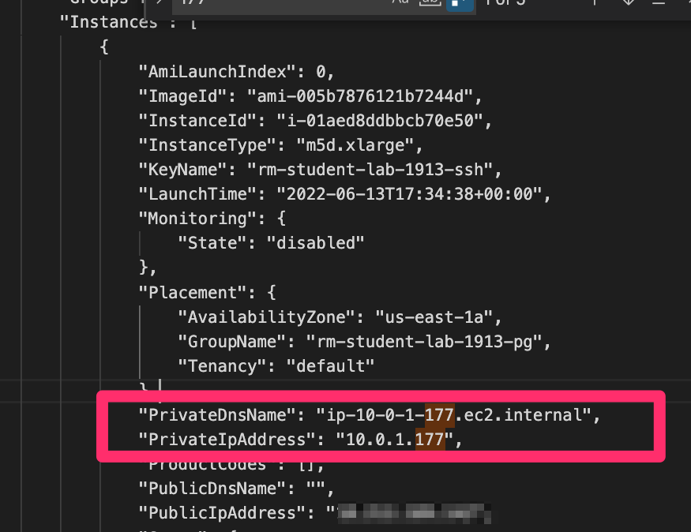
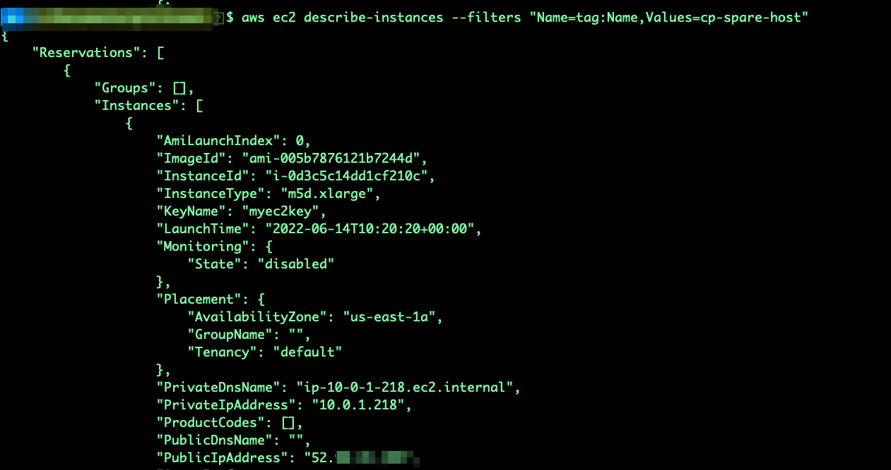

# Adding Hosts to AWS based Satellite Location

## Review

The following resources are created by the template in your AWS cloud account via the Satellite AWS Quickstart Terrform/Schematics template.

- 1 virtual private cloud (VPC).
- 1 subnet for each of the 3 zones in the region.
- 1 security group to meet the host networking requirements.
- 6 EC2 instances spread evenly across zones, or the number of hosts that you specified.

The following resources are created by the template in your account.

- 1 Satellite location.
- 3 Satellite hosts that represent the EC2 instances in AWS, attached to the location and assigned to the Satellite location control plane.
- 3 Satellite hosts that represent the EC2 instances in AWS, attached to the location, were innitially unassigned and later used by the OpenShift Cluster you created.


## Adding RHEL hosts using the AWS CLI

We would like to add to our existing location 2 hosts we need later for other exercises. In a real customer environment you would automate the following steps, using Terraform, Ansible or other automation capabilities.

1. Download and install the AWS CLI following those [instructions](common/clis/clis.md#aws-cli).

1. To login into your aws account use the below command on your terminal

    a.  aws configure
    b.  Fill in the details
    c.  AWS Access Key ID: **************
    d.  AWS Secret Access Key: **************
    e.  Default region name: us-east-2
    f.  Default output format: json

1. create a new SSH key Pair on your machine

   ```sh
   ssh-keygen -t rsa -b 4096 -C "<your mail address>" -f myec2key-<your-initials> 
   ```

1. Upload the SSH Key to your AWS account

   ```sh
    aws ec2 import-key-pair --key-name "myec2key-<your-initials>" --public-key-material fileb://./myec2key-<your-initials>.pub
   ```

   The output should look something like this:

   

   You could verify the that the key was uploaded using the following command:

   ```sh
   aws ec2 describe-key-pairs
   ```

1. We need need now to grab some parameters of the existing EC2 instances for our new hosts. (This step is for learning purpose, in real life adding hosts will be automated).

   ```sh
   aws ec2 describe-instances > ec2.txt
   ```

   Open the text file in a editor of your choice and find the section of the Control Plane Host in Zone us-east-1a using the private IP listed in the location.

   

   

   As alternative you could use jq CLI to process the aws CLI output.

   [jq CLI json processor](https://github.com/stedolan/jq/wiki)

   [jq cheat sheet](https://lzone.de/cheat-sheet/jq)

   ```sh
   aws ec2 describe-instances | jq '.Reservations[].Instances[] | select (.PrivateIpAddress=="10.0.1.240") | {PrivateIpAddress,PublicIpAddress,SecurityGroups,SubnetId,ImageId,InstanceType,Placement}'
   ```

   

1. Extract the following information

   - InstanceType ("m5d.xlarge" or "m5d.4xlarge" please ask Instructor!)
   - ImageId (like "ami-005b7876121b7244d")
   - AvailabilityZone (like "us-east-1a")
   - SubnetId (subnet-xxxxxxxxx)
   - Security GroupId: (sg-xxxxxxxxx)

   With that create the instance.

   ```sh
   aws ec2 run-instances --image-id ami-005b7876121b7244d --count 1 --instance-type m5d.4xlarge --key-name myec2key-<your-initials> --security-group-ids sg-0629184d40178da37 --subnet-id subnet-003da7ab0683c6c1b --associate-public-ip-address --tag-specifications 'ResourceType=instance,Tags=[{Key=Name,Value=cp-spare-host}]'
   ```

   wait a minute and get the details of the machine including public IP address:

   ```sh
   aws ec2 describe-instances --filters "Name=tag:Name,Values=cp-spare-host"
   aws ec2 describe-instances --filters "Name=tag:Name,Values=cp-spare-host" --query 'Reservations[*].Instances[*].PublicIpAddress'
   ```

     
   

1. Repeat the steps 5-6 for a second host using the same subnet, m5d.4xlarge flavor and name svc-spare-host.

   ```sh
   aws ec2 run-instances --image-id ami-005b7876121b7244d --count 1 --instance-type m5d.4xlarge --key-name myec2key-<your-initials> --security-group-ids sg-0629184d40178da37 --subnet-id subnet-003da7ab0683c6c1b --associate-public-ip-address --tag-specifications 'ResourceType=instance,Tags=[{Key=Name,Value=svc-spare-host}]'
   
   ```sh
   aws ec2 describe-instances --filters "Name=tag:Name,Values=svc-spare-host"
   
   aws ec2 describe-instances --filters "Name=tag:Name,Values=svc-spare-host" --query 'Reservations[*].Instances[*].PublicIpAddress'
   ```

   You should now have 2 public IPs for your spare hosts

1. Enable SSH in default AWS Security Group

   Because the Satellite Terraform Template does not enable SSH we need to modify the existing VPC Security Group

   ```sh
   aws ec2 authorize-security-group-ingress --group-id sg-0629184d40178da37 --protocol tcp --port 22 --cidr 0.0.0.0/0
   ```

   

## Attaching the Hosts to the IBM Cloud Satellite location

Now we have created the 2 AWS EC2 hosts with their public IPs. Now we would like to attach the hosts to our IBM Cloud Satellite location.

1. Connect via IBM Cloud CLI to the IBM Cloud account
  
  ```sh
   ibmcloud login --sso
   ibmcloud target -g academyrg
   ```

     

1. Download the Satellite Location Host attach script
  
  ```sh
   ibmcloud sat location ls
   ibmcloud sat host attach --location <your location ID>
   ```

   

1. Edit the Script to enable RHEL repos

   Open the registration script. After the `API_URL` line, add a section to pull the required RHEL packages with the subscription manager.

    ```sh
    # Enable AWS RHEL package updates
    yum update -y
    yum-config-manager --enable '*'
    yum repolist all
    yum install container-selinux -y
    echo "repos enabled"
    ```

      

1. Copy the Script to the EC2 instances

   ```sh
   scp -i myec2key-<your-initials> <YOURSCRIPT> ec2-user@52.90.45.209:/home/ec2-user/
   ```

1. SSH into the machine using your previously created key

   ```sh
   ssh -i myec2key-<your-initials> ec2-user@52.90.45.209
   sudo nohup bash <YOURSCRIPT> &
   ```

1. Monitor the progress of the registration script. Wait.

   ```sh
      sudo journalctl -f -u ibm-host-attach
   ```

   

1. Repeat Step 4-6 on your 2 new hosts.

1. Check that your hosts are shown in the **Hosts** tab of your Sattelite location.

   
