# Do It -- Build Demo Environment for Satellite in AZURE

> This document is tailored for the Satellite Tech Academy Students.

## Table of contents

- [Purpose](#purpose)
- [Overview](#overview)
- [Target audience](#target-audience)
- [Pre-requisites](#pre-requisites)
  - [Request an Azure environment on Techzone](#request-an-azure-environment-on-techzone)
    - [Azure credentials](#azure-credentials)
    - [IBM Cloud Account](#ibm-cloud-account)
- [Build Satellite env](#build-satellite-env)
  - [Create Cloud Object Storage Instances](#create-cloud-object-storage-instances)
  - [Create location in IBM Cloud](#create-location-in-ibm-cloud)
  - [Verify Schematics template is applied](#verify-schematics-template-is-applied)
  - [Verify Satellite location is created](#verify-satellite-location-is-created)
- [Deploy Red Hat OpenShift onto Satellite location](#deploy-red-hat-openshift-onto-satellite-location)
  - [Create cluster using IBM Console](#create-cluster-using-ibm-console)
  - [Review satellite and ROKS resources with ibmcloud CLI](#review-satellite-and-roks-resources-with-ibmcloud-cli)
- [Clean Up](#clean-up)  

## Purpose

This document helps complete pre-requisites for the Satellite Academy session. Students will perform following steps as pre-reqs

1. Deploy Satellite location using Azure infrastructure

1. Deploy Red Hat OpenShift cluster.

## Overview

IBM Cloud Satellite can be deployed anywhere as depicted in this picture; however, this exercise helps you experience it by creating Satellite location in AZURE infrastructure. This demo collection provides a fully automated method to deploy Satellite on AZURE and deploying Red Hat OpenShift cluster onto that Satellite location. That builds a container platform that is ready for developers to build and run cloud native applications.

## Target audience

IBM Cloud Sellers, Tech Sales, CSM, CSC, Client
Engineering and Business Partners

## Pre-requisites

To experience Satellite using Azure infrastructure, access to both Azure and IBM Cloud environment is needed.

The IBM Cloud environment is used to create Satellite location, the management side of the service, and from where you will start the creation / deployment of any satellite-enabled service.

Azure environment is used as IaaS, is where you will provision network, VMs (compute) and storage infrastructure required to deploy the Satellite location and where the satellite-enabled services will work.

Here is the demo environment that needs to be built.

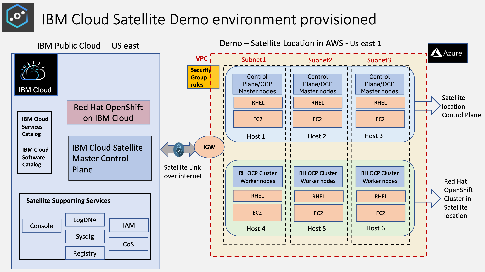

## Request an Azure environment on Techzone

### Azure credentials

There is a Tech Zone demo collection specially created for the Satellite Academy and is available [here](https://techzone.ibm.com/collection/cloud-platform-tech-academy-satellite).

1. Create the Azure environment, in TechZone in this demo collection, in environment section, click on resource named '***Request Azure Infrastructure for Satellite location'*** to obtain AZURE API credentials to use compute and storage.

    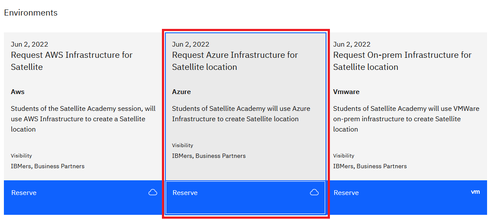

    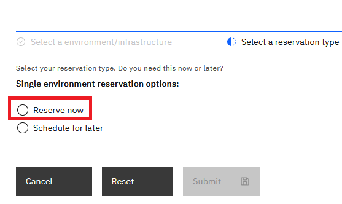

    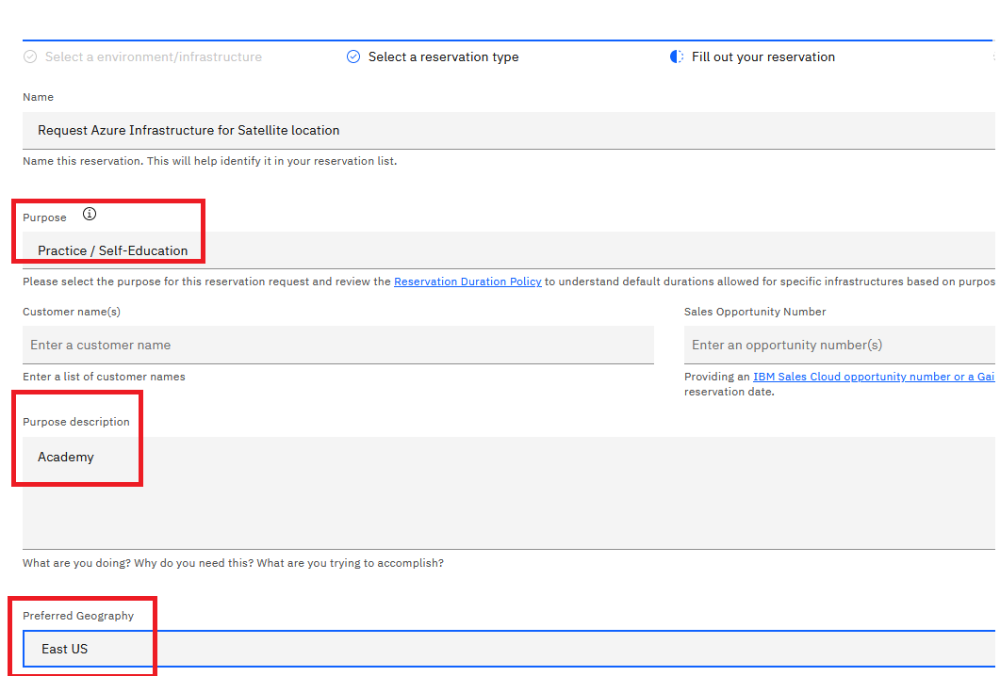

1. Once the Azure environment is created an email will be sent by TechZone confirming access to AZURE with required credentials.

1. You can also verify status of your request for the environment, in TechZone portal go to My Library and click on My Reservations

    

1. You will see your request

    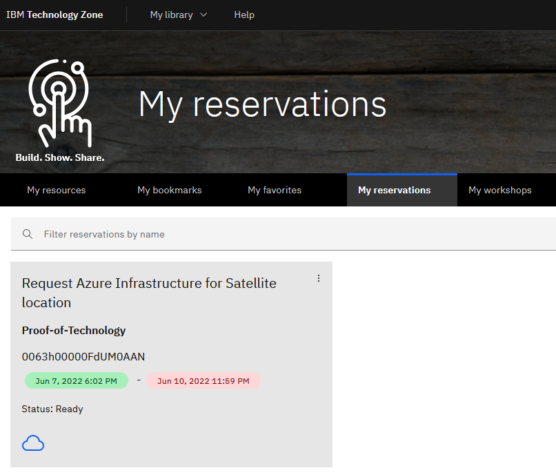

1. If you click on it you will see your credentials:

    

### IBM Cloud Account

The IBM Cloud environment is pre-assigned to each Academy student using temporary IBM Cloud account provisioned in an Enterprise Account owned by TechZone.

You will get an email with an invitation to join this special IBM cloud account. IBM Cloud account will look like this with last two digits being different for each Student Ex "tztsglenablementxx" (expands to something like... TechZone Tech Sales Global Enablement xx)

## Build Satellite env

### Create Cloud Object Storage Instances

1. In IBM Cloud [Catalog](https://cloud.ibm.com/catalog) look for the service `Object Storage`

    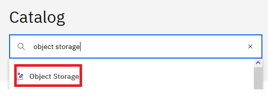

1. Create an instance

    

    

    

1. Click Create

    

### Create location in IBM Cloud

1. Go to [IBM Cloud](https://cloud.ibm.com) and login using w3 id

1. Make sure to switch to Demo account provided by IBM TechZone (ITZ) by clicking on the drop-down menu on your name and select TechZone Account.

    

1. Go to the left navigation menu, on top left corner to the left of IBM Cloud and select **Satellite**

    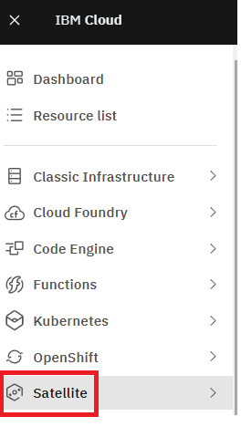

1. Create a Satellite location.

    

1. Click on the tile named **Azure Quick Start** to use AZURE infrastructure

   

1. Under AZURE Credentials, copy paste the AZURE Client id, Tenant id and Client Secret key (password), received from ITZ, and click the button on Fetch Options from AZURE

    

1. Change the host profile selected for the Azure VMs. Use Standard_D16as_v4, this is 16vCPU, 64GB Memory and 128GB disk.

   

   

   This size fits for future labs. For more information about satellite sizing, refer to this [doc](https://cloud.ibm.com/docs/satellite?topic=satellite-about-locations#control-plane-how-many-clusters)

1. Click on "Done Editing"

   

1. Click Edit on Satellite Location

   Also take note we are using Washington DC. (east-us)

   

   Change the name of the Satellite location and select the Resource Group "academyrg"

   

   Location will be managed from Washington

   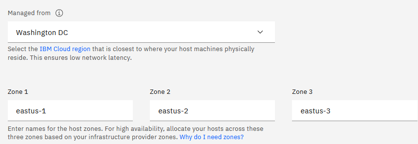

   Click "Done Editing"

   

1. Create Location

   

> IaaS and Satellite location creation will take like 30 mins, but after this it is also assigned three hosts as control planes, this assignment takes like 1 hour.

### Verify Schematics template is applied

1. Go to schematics and look for workspace by the name of the satellite location

    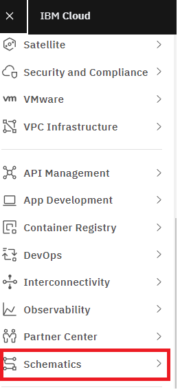

1. Click on the workspace and job

    

    

1. You can also go to specific Schematic workspace by clicking on the location and click on "Manage in Schematics" Blue button

    

1. Wait until it is applied successfully (30 mins)

1. Click on Resources to see what resources the schematics template has created automatically

    

If you see the schematics job logs, the terraform template used to create the locations, hosts, Azures IaaS, attach and assign control plane hosts is availble on this [Github terraform-ibm-modules repo](https://github.com/terraform-ibm-modules/terraform-ibm-satellite/releases/download/v1.1.2/azure-v1.1.2.tgz)

If you are familiar with terraform and not with schematics you can always download the terraform and use it locally... In this case take a look to the Setting section of the schematics workspace to see the variables values.

In case of errors with Schematics, refer to the section [Clean up](#clean-up).

### Verify Satellite location is created

1. Go to the left navigation menu, on top left corner to the left of IBM Cloud and the click on Satellite Locations

   

1. Click on the location that was created and is in `Normal` state

   

    > The status will be in `Action Required` for about 1h while the control planes are being assigned, deployed and configured.
    >
    > Below is a potential errors you might see during the control plan assign process, with the schematics template the first two actions, attach hosts and assign hosts as control planes are automatically done.

    

1. On the Overview page, see AZURE infrastructure is used and number of hosts attached

     

1. On left side, click on Hosts to show the hosts attached to the location and hosts available for ROKS cluster

    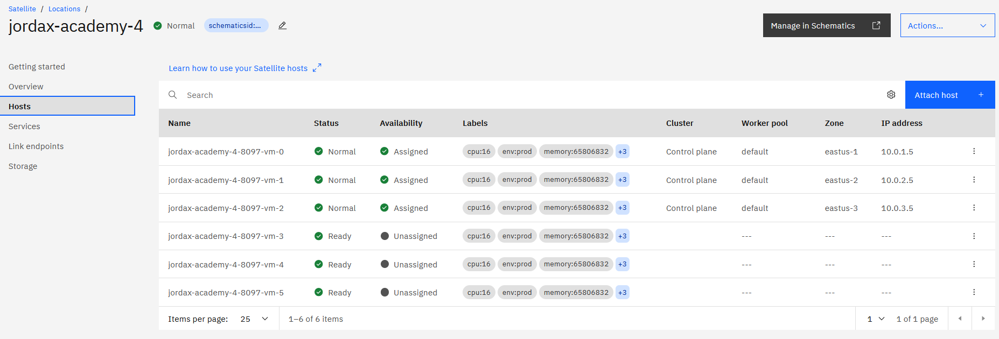

## Deploy Red Hat OpenShift onto Satellite location

### Create cluster using IBM Console

1. Go to the left navigation menu, on top left corner to the left of IBM Cloud and Select OpenShift then Clusters

    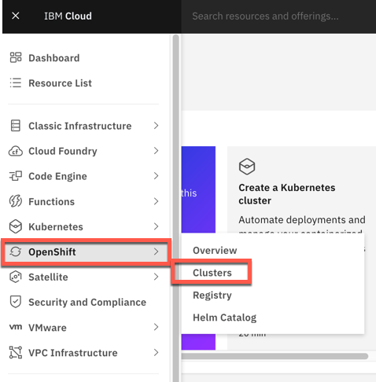

1. click on Create Cluster

    

1. Here I see Satellite as another Infrastructure choice for me to deploy Red Hat OpenShift. Choose Satellite as my Infrastructure of choice

    

1. Now I see all the Satellite locations including my on-prem locations or other clouds. In the name column, select the radio button for the Satellite location you just created and also select the Resource Group

    

1. Select the zones and the hardware requirement for the available hosts in the location. These values are used as "Selectors", when we start the creation of the cluster it will look for hosts with labels `cpu=4`, `memory=16` and `zone=eastus-1 / 2 / 3` attached and available in the location and will start the deployment of ROKS on them. You can also start the deployment manually from the Satellite location page.

1. In our case the hosts are 16 vCPU and 32 GB (LMA), that's why you see the following message:

    

1. Click on "Get values from available hosts"

    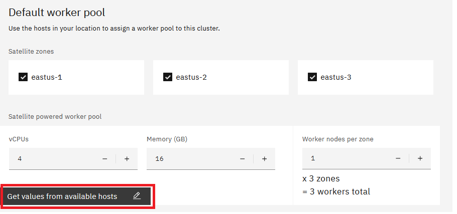

    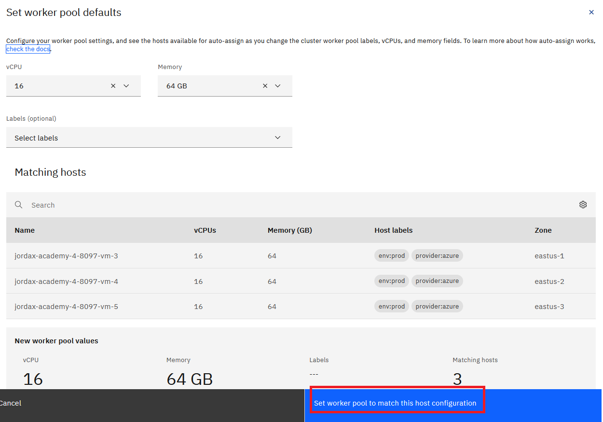

    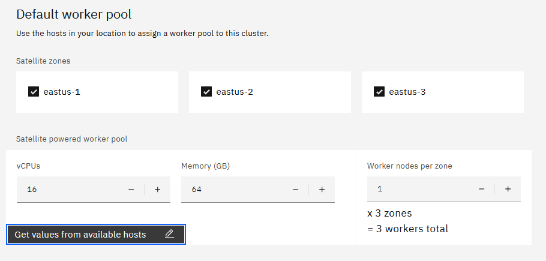

1. Select the version

    

1. Configure OCP Entitlement

    

    Depending on the account and the user logged in you will see these options for OCP entitlement, select **Purchase additional licenses for this cluster**.

    Customers have the ability to bring their own license. In this case, they should selet the option `Managed with Red Hat OpenShift Cluster Manager`.

1. Check the box `Enable luster admin access to Satellite Config` to manage K8S resources in this clusters and then submit the deployment by hitting the Create.

    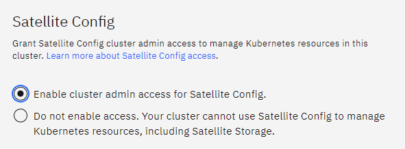

1. Select a name

    

1. Click on the **Create** button on right highlighted in Blue

    

1. You can check the cluster status

     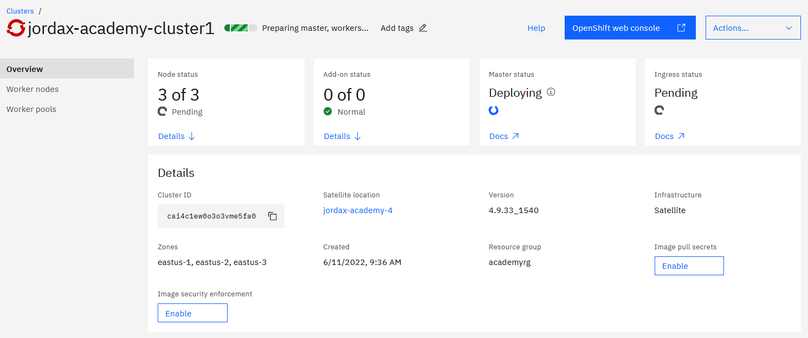

     After 30 mins

     

     The "Unknown" status for ingress is because currently the ROKS Cluster is only accessible using Azure private IPs, in next sections we will change this.

### Review satellite and ROKS resources with ibmcloud CLI

1. Install IBM Cloud CLI. For more information, go the [documentation](https://cloud.ibm.com/docs/cli?topic=cli-install-ibmcloud-cli)

    ```bash
    curl -fsSL https://clis.cloud.ibm.com/install/linux | sh

    ibmcloud version
    ibmcloud version 1.3.0+4308925-2020-12-16T07:53:49+00:00
    ```

1. Install ROKS/IKS/Satellite plugin

    ```bash
    ibmcloud plugin install container-service
    ```

1. Login use "--sso" in case you have SSO configured with IBM Cloud, like for example the case of IBM users.

    ```bash
    ibmcloud login --sso

    Select an account:
    18. itztsglenablement23 (20c282cbc5174bdbaddb0a5b94025d9f) <-> 2566264
    Enter a number> 18
    ```

1. Target the correct region and resource group.

    ```bash
    ibmcloud target -r us-east
    ibmcloud target -g academyrg
    ```

1. List all the Satellite location

    ```bash
    ibmcloud sat location ls
    Retrieving locations...
    OK
    Name               ID                     Status   Ready   Created        Hosts (used/total)   Managed From
    jordax-academy-4   cahrvp4w07i0nklqkbpg   normal   yes     20 hours ago   6 / 6                wdc
    ```

1. Set your location name in an environment variable. Replace the value `<your-location-name>`

    ```bash
    export SAT_LOC_NAME=<your-location-name>
    ```

1. Get the detailed about your location

    ```bash
    ibmcloud sat location get --location $SAT_LOC_NAME
    ```

    Console Output:

    ```bash
    Retrieving location...
    OK

    Name:                           jordax-academy-4
    ID:                             cahrvp4w07i0nklqkbpg
    Created:                        2022-06-10 22:04:20 +0000 (20 hours ago)
    Managed From:                   wdc
    State:                          normal
    Ready for deployments:          yes
    Message:                        R0001: The Satellite location is ready for operations.
    Hosts Available:                0
    Hosts Total:                    6
    Host Zones:                     eastus-1, eastus-2, eastus-3
    Public Service Endpoint URL:    https://c117.us-east.satellite.cloud.ibm.com:30623
    Private Service Endpoint URL:   -
    OpenVPN Server Port:            -
    ```

1. Retrieve the hosts your location

    ```bash
    ibmcloud sat host ls --location $SAT_LOC_NAME
    ```

    Console Output:

    ```bash
    Retrieving hosts...
    OK
    Name                         ID                     State      Status   Zone       Cluster                   Worker ID                                                 Worker IP
    jordax-academy-4-8097-vm-0   8fe21455c461b7c5f1c8   assigned   Ready    eastus-1   infrastructure            sat-jordaxacad-17e0838ef2f18816073fecfd9d47654a39e7adb6   10.0.1.5
    jordax-academy-4-8097-vm-1   9c0fb2637ab5648d825e   assigned   Ready    eastus-2   infrastructure            sat-jordaxacad-a3fd11beb529760d5f4becd8997746a861425da9   10.0.2.5
    jordax-academy-4-8097-vm-2   351f3abe5a6fbb104385   assigned   Ready    eastus-3   infrastructure            sat-jordaxacad-81f5a6f7c0efa9d7a6eb716c0e5ec2b6191caa13   10.0.3.5
    jordax-academy-4-8097-vm-3   5b33952eb5977b12f358   assigned   Ready    eastus-1   jordax-academy-cluster1   sat-jordaxacad-55847d996827e864c000dcdd7ce7ef9dded4c064   10.0.1.4
    jordax-academy-4-8097-vm-4   47c8eb5de2c7bd529828   assigned   Ready    eastus-2   jordax-academy-cluster1   sat-jordaxacad-1e761d69f4d5b70172a48878cdb03e1bb44671e2   10.0.2.4
    jordax-academy-4-8097-vm-5   84f968d581ffe92f1dfb   assigned   Ready    eastus-3   jordax-academy-cluster1   sat-jordaxacad-4fef61281c52743bdae145dea17922337408b2f5   10.0.3.4
    ```

1. Retrieve the list of clusters

    ```bash
    ibmcloud ks cluster ls
    ```

    Console Output

    ```bash
    OK
    Name                      ID                     State    Created        Workers   Location           Version                 Resource Group Name   Provider
    jordax-academy-cluster1   cai4c1ew0o3o3vme5fa0   normal   11 hours ago   3         jordax-academy-4   4.9.33_1540_openshift   academyrg             satellite
    ```

1. Set your cluster name in an environment variable. Replace the value `<your-cluster-name>`

    ```bash
    export CLUSTER_NAME=<your-cluster-name>
    ```

1. Get the info of your cluster

    ```bash
    ibmcloud ks cluster get --cluster $CLUSTER_NAME
    ```

    Console Output

    ```bash
    Retrieving cluster jordax-academy-cluster1...
    OK

    Name:                           jordax-academy-cluster1
    ID:                             cai4c1ew0o3o3vme5fa0
    State:                          normal
    Status:                         All Workers Normal
    Created:                        2022-06-11 07:36:37 +0000 (11 hours ago)
    Resource Group ID:              67a3bfe503c64e62b53ab0c4f4dd7da5
    Resource Group Name:            academyrg
    Pod Subnet:                     172.30.0.0/16
    Service Subnet:                 172.21.0.0/16
    Workers:                        3
    Worker Zones:                   eastus-1, eastus-2, eastus-3
    Ingress Subdomain:              jordax-academy-cluster1-edab36f30dbf4e1837574d4d2fc52fab-0000.us-east.containers.appdomain.cloud
    Ingress Secret:                 jordax-academy-cluster1-edab36f30dbf4e1837574d4d2fc52fab-0000
    Ingress Status:                 -
    Ingress Message:                -
    Public Service Endpoint URL:    https://c-02.private.us-east.link.satellite.cloud.ibm.com:35105
    Private Service Endpoint URL:   https://j80e9ce1185365420fe2d-6b64a6ccc9c596bf59a86625d8fa2202-ce00.us-east.satellite.appdomain.cloud:31222
    VPCs:                           -

    Master
    Status:     Ready (11 hours ago)
    State:      deployed
    Health:     normal
    Version:    4.9.33_1540_openshift
    Location:   jordax-academy-4
    URL:        https://j80e9ce1185365420fe2d-6b64a6ccc9c596bf59a86625d8fa2202-ce00.us-east.satellite.appdomain.cloud:31222
    ```

## Clean up

Do NOT execute this section, until end of the Academy or if you have issues during the creation of the location.

For Clean Up you have to remove Azure resources and IBM Satellite Location

### Remove Azure resources through Schematics

1. In your Schematics workspace, select Actions **Destroy Resources**.

    

1. If this fails, that usually fails then remove resources using the Azure CLI.

### Remove Azure resources through Azure CLI

We need to remove the Azure Resource Group which is generated by the terraform template executed with Schematics.

1. Go to the Schematics **workspace**

    

1. Go to **Settings** of this workspace.

    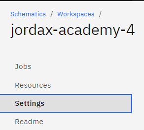

1. In Variables look for `az_resource_group`. In this case it is "jordax-academy-4-9602"

    

### Remove the Azure Resource Group

Using student VSI. See [Student VSI](../common/student-vsi/readme.md)

Using the Azure credentials received by mail or gathered from Tech Zone web:

- `clientid` in place of app_id after -u
- `clientSecret` for password-or-secret after -p
- `tenantId` for tenant

1. Login to Azure

    ```sh
    az login --service-principal -u 58d21686-2688-426f-892e-c7aabed76a51 -p xxx --tenant 4e7730a0-17bb-4dfa-8dad-7c54d3e761b7
    ```

1. Delete the Azure Resource Group

    ```bash
    az group delete -n jordax-academy-4-9602
    ```

This removes the resource group and all its resources.

### Remove the location

1. From IBM Cloud Console

    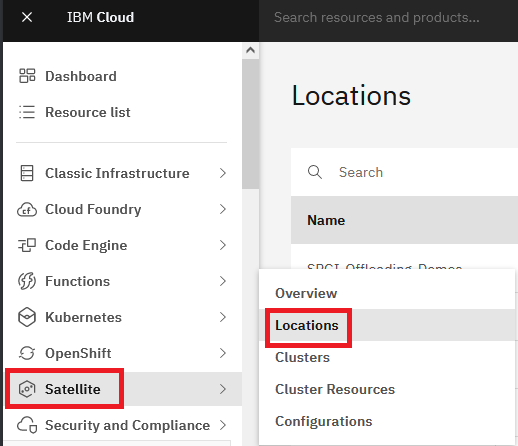

1. Select your location and delete it.

    
