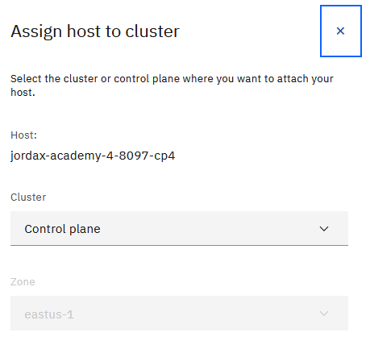
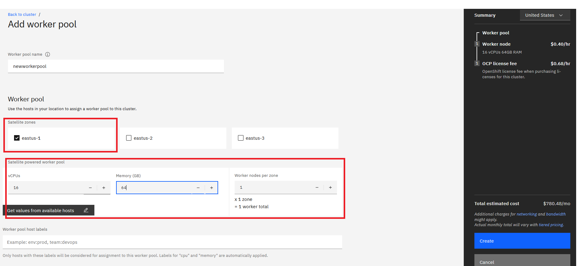
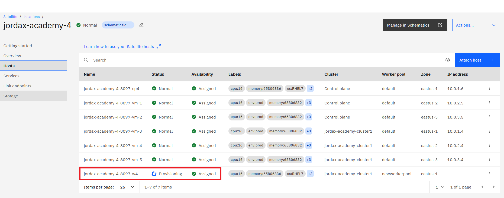

# Replace Control Plane and Worker Node

In this lab, we will replace an host attached to the control plane and add a new worker to ROKS.

## Table of contents

- [Replace Control plane](#replace-control-plane)
  - [Remove existing host](#remove-existing-host)
  - [Assign a new host as Control Plane](#assign-a-new-host-as-control-plane)
- [Add new worker to ROKS](#add-new-worker-to-roks)
- [Fix public IP Assignment for Control Plane and ROKS](#Fix-public-IP-Assignment-for-Control-Plane-and-ROKS)

## Replace Control plane

### Remove existing host

It is important to learn that Control Planes must **never** be removed all together, you have to replace one by one waiting between them, this is because in the Control Plane nodes is where kubernetes ETCD database resides, so if you remove more than one at the same time the ETCD will stop working and you will have to ask via IBM ticket to restore a backup. (once you have three control planes ready again)

We will remove a control plane in the same zone where we attached the new hosts. **Please note that the names of the nodes/zones in the screenshots might differ, depending on your environment! Also you need to update DNS of Sat Control Plane and ROKS NLB DNS entries afterwards**  

The new host we attached is on eastus-1


1. So remove the control plane from eastus-1 (not the Unassigned node)

    

1. After some minutes the Location state will switch to warning.

    

1. Going over the Information icon, you will see this messages, R0012 will be the final one.

    > R0047: IBM Cloud is unable to use the health check endpoint to check the location's health. For more information, see 'https://ibm.biz/satloc-ts-healthcheck'. For more information, see the [docs](https://cloud.ibm.com/docs/satellite?topic=satellite-ts-locations-debug).
    >
    > R0043: The location does not meet the following requirement: Hosts must have TCP/UDP/ICMP Layer 3 connectivity for all ports across hosts https://ibm.biz/sat-loc-debug#R0043. If you still have issues, contact IBM Cloud Support and include your Satellite location ID.
    >
    > R0012: The location control plane does not have hosts in all 3 zones.  Add available hosts to your location for the control plane. For more information, see the [docs](https://cloud.ibm.com/docs/satellite?topic=satellite-ts-locations-debug).

1. Check the status of the location with the CLI

    ```sh
    ibmcloud sat location get --location <location-name>
    ```

    The output will be similar to

    ```sh
    ID:                             cahrvp4w07i0nklqkbpg
    ...
    State:                          action required
    Ready for deployments:          no
    Message:                        R0012: The location control plane does not have hosts in all 3 zones. Add available hosts to your location for the control plane.
    ```

### Assign a new host as Control Plane




Refresh


It takes like 30 mins

Normal "on-going states" even if the control plane is Assigned and normal


https://cloud.ibm.com/docs/satellite?topic=satellite-ts-locations-debug#R0012

> If you just assigned hosts to the control plane, wait a while for the bootstrapping process to complete. Otherwise, assign at least one host to each of the three zones for the location itself, to run control plane operations.

Finally...


## Add new worker to ROKS

Review the vCPU, Memory and Zone of the worker you attached, in this case it was:


So 16vCPU, 64GB and zone "eastus-1" so we will configure the new worker to enable "auto-assign" to work properly. If not we can always assign the node to the worker pool using the satellite hosts UI as we did with the Control Plane.

Go to ROKS worker pools


Deploy only 1 Worker.



Check in the location that the "Unassigned" node is now "Assigned" to our cluster, give it like 10 minutes



## Fix public IP Assignment for Control Plane

Do this lab once the control plane has been successfully assigned and the location status is green again.

Because we have now changed the Hosts in the Satellite Control Plane we need to update the Sattelite DNS. Please follow the steps for the Control Plane only:

- For Azure: [Reset public IPs](azure/AcademyLabs.md#lab-4---remove-and-replace-an-existinghost---control-plane)
- For AWS: [Public IPs](aws/aws-access-roks-inet.md)
