# Lab 6: Configure OCP Image registry using IBM CoS

## Table of Content

- [Introduction](#introduction)
- [Provision IBM Cloud Object Storage](#provision-ibm-cloud-object-storage)
- [Create a Bucket for your Image Repository](#create-a-bucket-for-your-image-repository)
- [Create Service Credentials including HMAC](#create-service-credentials-including-hmac)
- [Configure OpenShift to use Object Storage for the Image Registry](#configure-openshift-to-use-object-storage-for-the-image-registry)
- [Deploy example App to check that Registry is working - Optional](#deploy-example-app-to-check-that-registry-is-working---optional)

## Introduction

When you deploy a ROKS cluster via IBM Cloud Sattelite the Image Registry is not configured. There are many storage backends possible in such a scenario depending on what infrastructure is used. For sake of simplicity we will use IBM Cloud Object Storage in our example, but the same would be possible with other storage backends like AWS S3, local storage.

See also <https://docs.openshift.com/container-platform/4.9/registry/index.html>

> When you install Cloud Pak for Data, the installer is going to copy the images Cloud Pak for Data will use to your local image registry. This is done to greatly improve the speed of the installation process. The first thing we are going to do is create an IBM Cloud Object Storage instance and bucket.

## Provision IBM Cloud Object Storage

1. From the IBM Cloud [catalog](http://cloud.ibm.com/catalog), search for **Object Storage**.

    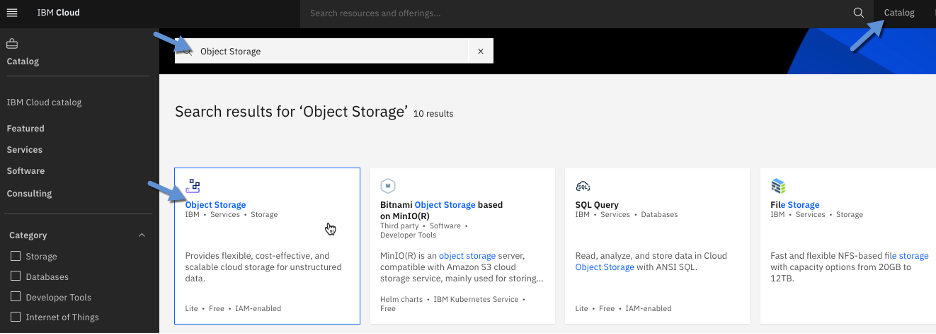

1. Select the **IBM Cloud based option NOT Satellite**!

    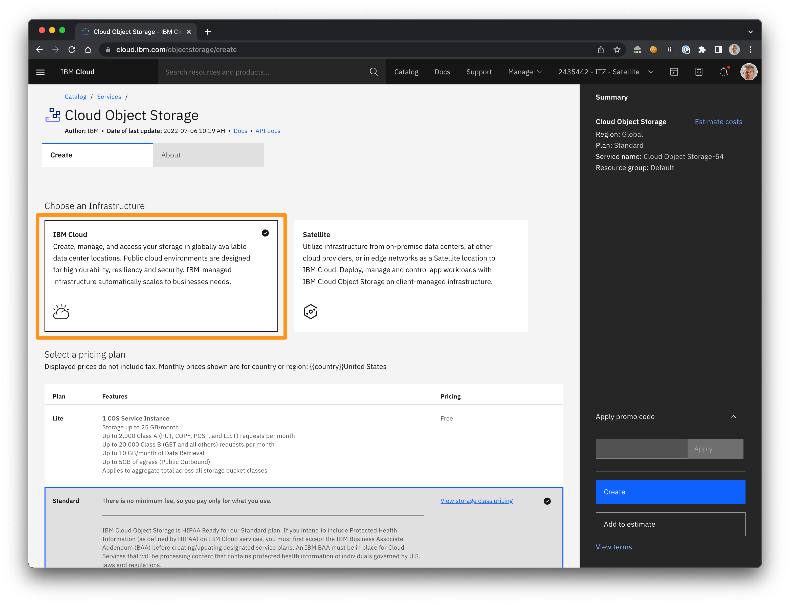

1. Give the instance of Object Storage a meaningful name such as `Cloud Object Storage-Satellite` and choose the Resource Group where your satellite resources are to location to keep things organized.

    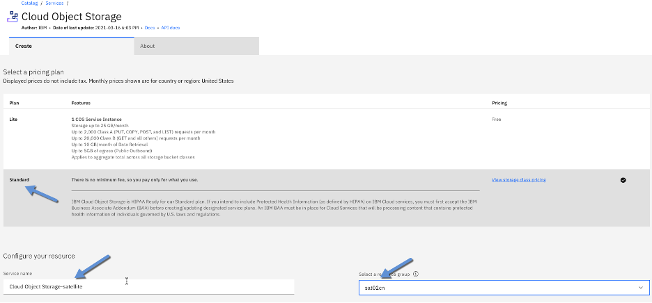  

## Create a Bucket for your Image Repository

The next thing we need to do, is create a bucket for our image registry.  This bucket needs to have a couple specific settings so please make sure to closely follow the guide here.

From your cloud object storage instance, click on Buckets and then Create bucket.

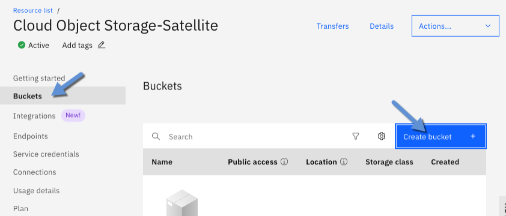

Next, click on Customize your bucket:

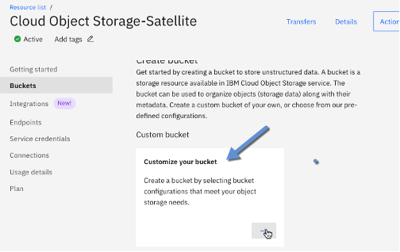

On the next screen, name your bucket something meaningful, bucket names need to be unique, I will use sat-cluster-image-registry-kmc.   Note: the name of your bucket must be unique in the region where you are creating it, so you may want to use your initials like I have.  


Select Regional for resiliency, Location: us-east and then standard as the storage class.  Note: With the exception of location, this should be whatever region is closest to your satellite location, it is important to select the values exactly as indicated.  After entering these settings, click on Create Bucket.

## Create Service Credentials including HMAC

Now that we have created a bucket, the next step is to create Service Credentials so that our OpenShift cluster can talk to our instance of Cloud Object Storage to read and write images to the bucket we created.

On the left-hand navigation pane, select Service Credentials and then click on New Credential.

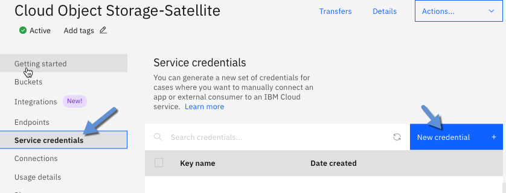

On the next screen, give your credentials a meaningful name, I will choose Service-credentials-satellite-registry, role should be Write and turn on ***HMAC***.


On the next screen note down the Access Key and the Secret Access Key. Make sure not to share this with anyone.


## Configure OpenShift to use Object Storage for the Image Registry

Next, we need to create a secret for our image registry to talk to Cloud Object Storage.

1. Start your terminal, log into IBM Cloud and your cluster.

    ```sh
    ibmcloud login --sso # target your ITZ IBM Cloud demo account
    ibmcloud target -g <your-resource-group> -r <region>
    ibmcloud ks cluster config --cluster <cluster_name> --admin
    ```

      

If you use IBM Cloud Shell you could use the following IBM Cloud command to connect to the cluster:

```sh
ibmcloud ks cluster config --admin -c <cluster-name> --endpoint link
````

Change the following command to use

- `YOUR COS ACCESS KEY` is the `access_key_id` from the COS Service Credential
- `YOUR COS SECRET KEY` is the `secret_access_key` from the COS Service Credential

<code>
oc create secret generic image-registry-private-configuration-user --from-literal=REGISTRY_STORAGE_S3_ACCESSKEY=<YOUR COS ACCESS KEY> --from-literal=REGISTRY_STORAGE_S3_SECRETKEY=<YOUR COS SECRET KEY> --namespace openshift-image-registry
</code>


Check that the secret was created.

```sh
oc describe secret image-registry-private-configuration-user  -n openshift-image-registry
````

  

Now that we have our secret configured, we need to update the configuration of our image registry to point to the object storage instance and bucket we created.

The easiest way to do this, is through the OpenShift web console.  From cloud.ibm.com navigate to your satellite cluster and then click on OpenShift web console.

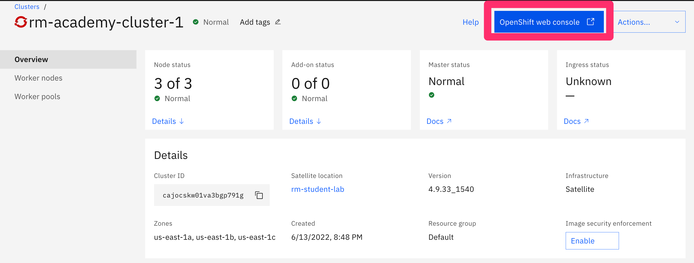

Once the OpenShift console opens, click on Search

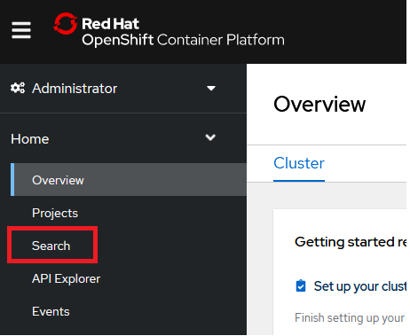

And search for ‘Config’ and the click on the Config – imageregistry.operator.openshift.io…

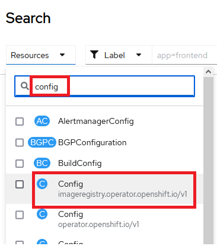

On the next screen, click on cluster.
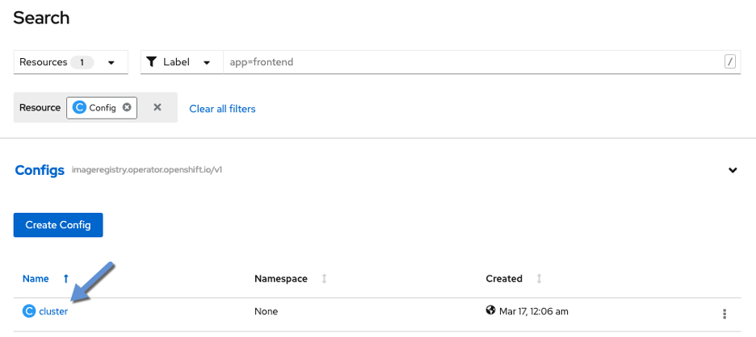

Click on YAML and then scroll down until you see this section:

```yaml
  managementState: Removed
  proxy:
    http: ''
    https: ''
    noProxy: ''
  httpSecret: dAagViLyMeJodISdQpqcXtodpd6c6ojGyZeGEFnKTjhvpsalEs6vF33Hz5iSldS6
  storage: {}
````


We need to make changes to the managementState and the storage lines.

Note – Its hard to change Management State from UI, so its highly recommended to do it from CLI

What you will need to do, is change managementState to Managed.

Connect to the OCP cluster from CLI and run the following command to change management state

```sh
ibmcloud ks cluster config --cluster <cluster name> --admin
oc patch configs.imageregistry.operator.openshift.io cluster --type merge --patch '{"spec":{"managementState":"Managed"}}'
```

Then go back to UI, under storage enter the following with your bucket name:

```yaml
  storage:
    s3:
      bucket: sat-cluster-image-registry-kmc
      region: us-east-standard
      regionEndpoint: 'https://s3.us-east.cloud-object-storage.appdomain.cloud'
      virtualHostedStyle: false
```

If you prefer the CLI use the following command:

```sh
oc edit configs.imageregistry.operator.openshift.io/cluster
```

Note: In our case we need the public Endpoint because we connect from different locations.

After entering these settings, click Save and then Reload.  You should see the YAML has been updated with the settings you entered.

If you switch to the details page


And scroll down, you should see a message that the S3 bucket exists:


Don't worry for the other messages...


If you don’t see the "S3 Bucket Exists" message verify you entered your object storage secrets correctly and try to edit the config yaml again.  If it fails again, delete the config and start over.  When you delete the config, a new one will top up a couple of seconds later.

One additional check we can do to make sure the image registry really is configured, is looking at the image registry pod.


To find out if the registry is running as it should, click on Workload and the Pods.  Under project, search for and select openshift-image-registry and click on the image-registry pod.


On the next screen, click on the Environment tab make sure you see that your object storage is indicated.  If you don’t see object storage values like below, then try updating the config again.

## Deploy example App to check that Registry is working - Optional

Another way to make sure that the internal registry is working is to deploy the OpenShift node.js example app from the OpenShift CLI, which is using soure 2 image and will push the image to the registry.

```sh
oc new-app https://github.com/sclorg/nodejs-ex.git --name=hello-app --strategy=source
oc logs -f buildconfig/hello-app
```

<https://github.com/sclorg/nodejs-ex.git>


Check that your COS bucket has files from the Images/Image Registry Operator.

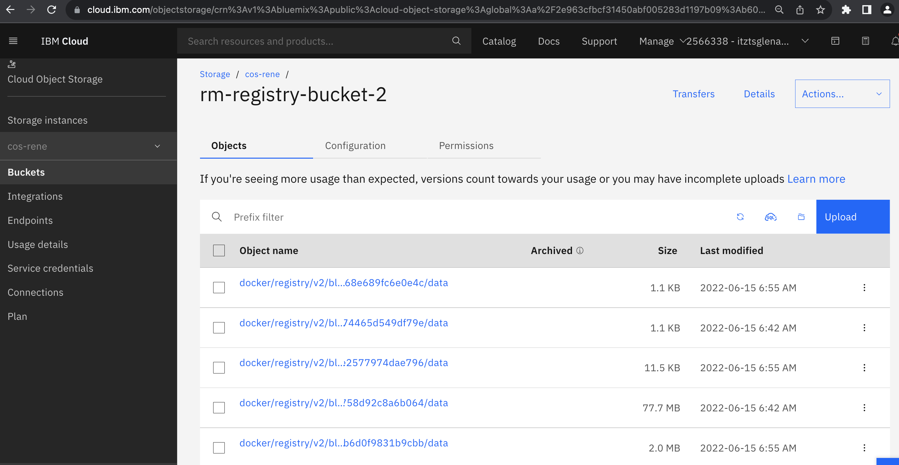
