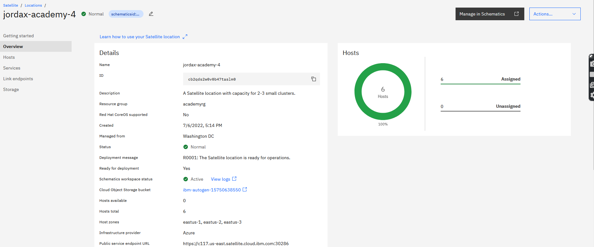

# Lab 1 - Check status of your Satellite location and ROKS cluster

## Check status from UI

1. Go to the left navigation menu, on top left corner to the left of IBM Cloud and the click on Satellite Locations

    

1. Click on the location

    

1. On the Overview page, you can see status is Normal

    

1. On left side click on **Hosts** to show the hosts attached to the location and all hosts in normal

    

1. Review Cluster state:

    

    

    > Ingress is `Unknown` because currently in the cluster displayed the nodes only has private IPs, we will change this later

## Check status using Satellite CLI

1. Install IBM CLI from [here](https://cloud.ibm.com/docs/cli?topic=cli-install-ibmcloud-cli)

    ```sh
    curl -fsSL https://clis.cloud.ibm.com/install/linux | sh

    ibmcloud version
    ibmcloud version 1.3.0+4308925-2020-12-16T07:53:49+00:00
    ```

1. During login use "--sso" in case you have SSO configured with IBM Cloud, like for example the case of IBM users.

    ```sh
    ibmcloud login --sso

    Select an account:
    18. itztsglenablement23 (20c282cbc5174bdbaddb0a5b94025d9f) <-> 2566264
    Enter a number> 18

    ibmcloud target -r us-east
    ibmcloud target -g academyrg
    ```

1. Check location status

    ```sh
    ibmcloud sat location ls
    ```

    Console ouput:
    ```sh
    Retrieving locations...
    OK
    Name               ID                     Status   Ready   Created        Hosts (used/total)   Managed From
    jordax-academy-4   cahrvp4w07i0nklqkbpg   normal   yes     20 hours ago   6 / 6                wdc
    ```

1. Retrieve the location status

    ```sh
    ibmcloud sat location get --location 
    jordax-academy-4
    ```

    Console output:

    ```sh
    Retrieving location...
    OK

    Name:                           jordax-academy-4
    ID:                             cahrvp4w07i0nklqkbpg
    Created:                        2022-06-10 22:04:20 +0000 (20 hours ago)
    Managed From:                   wdc
    State:                          normal
    Ready for deployments:          yes
    Message:                        R0001: The Satellite location is ready for operations.
    Hosts Available:                0
    Hosts Total:                    6
    Host Zones:                     eastus-1, eastus-2, eastus-3
    Public Service Endpoint URL:    https://c117.us-east.satellite.cloud.ibm.com:30623
    Private Service Endpoint URL:   -
    OpenVPN Server Port:            -
    ```

    > **R0001**: The Satellite location is ready for operations." is the correct message when the location is enabled and ready.
    >
    > If status indicates warning with an error code, refer to steps needed to fix it as in cloud docs https://cloud.ibm.com/docs/satellite?topic=satellite-ts-locations-debug

1. Check cluster status:

    ```sh
    ibmcloud ks cluster ls
    ```

    Console ouput
    ```sh
    OK
    Name                      ID                     State    Created        Workers   Location           Version                 Resource Group Name   Provider
    jordax-academy-cluster1   cai4c1ew0o3o3vme5fa0   normal   11 hours ago   3         jordax-academy-4   4.9.33_1540_openshift   academyrg             satellite
    ```

    ```sh
    ibmcloud ks cluster get --cluster jordax-academy-cluster1 | grep Status
    ```

    Console output:

    ```sh
    Status:                         All Workers Normal
    Ingress Status:                 -
    Status:     Ready
    ```
