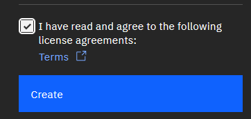
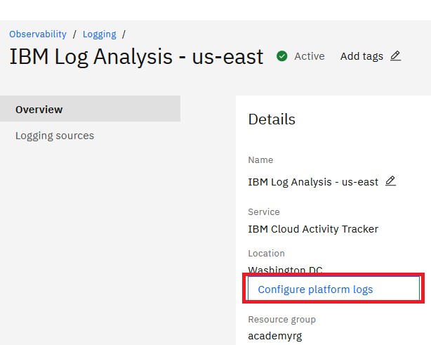
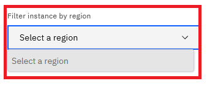
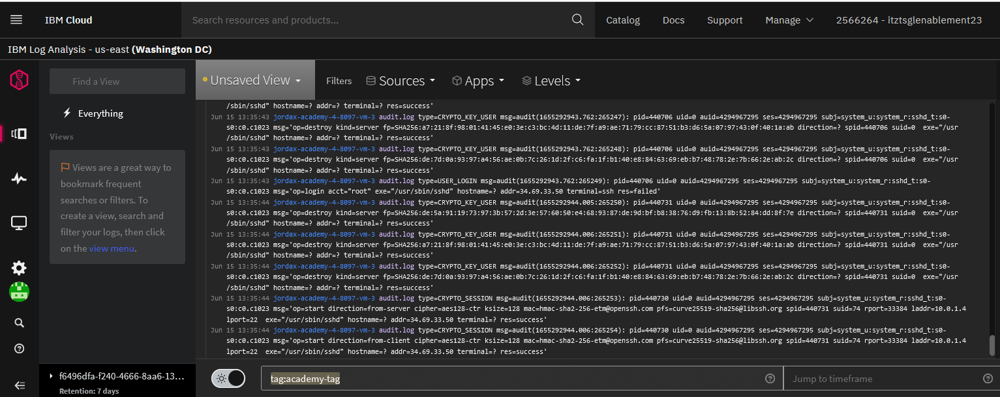
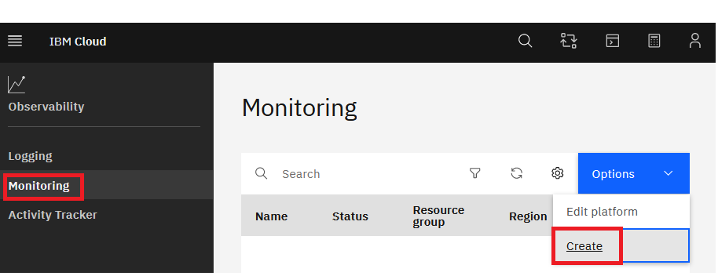
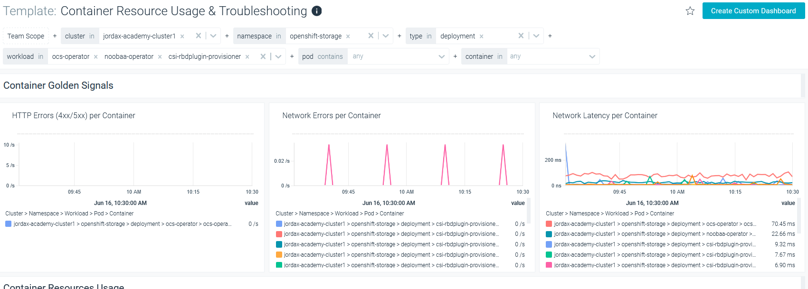

# Lab 7: Configure activity tracker and logging instances

## Table of contents

- [Observabilty](#observabilty)
  - [Logging](#logging)
  - [Monitoring](#monitoring)
  - [Activity Tracker](#activity-tracker)
- [Appendix](#appendix)
  - [Login to IBM Cloud](#login-to-ibm-cloud)

## Logging

### Create a logging instance

Go to Observability, you can do this although through the IBM Cloud Catalog





### Configure Platform logs

Configure the logging instance a "Platform logs" so in case there are some issues wit following labs there are logs available to troubleshoot.





If the "Filter instance by region" select box appears empty give it a pair of minutes.



Give it some minutes


### Deploy logging agent

In Satellite clusters you can not configure the IBM Cloud Logging using the console or the ibmcloud CLI, you must deploy manually the log agent.

#### Gather log DNA ingestion key

https://cloud.ibm.com/docs/log-analysis?topic=log-analysis-ingestion_key

Login to IBM Cloud. [Login](#login-to-ibm-cloud)

```
ibmcloud resource service-instances

Name                                                                  Location   State    Type               Resource Group ID
IBM Log Analysis - us-east                                            us-east    active   service_instance   67a3bfe503c64e62b53ab0c4f4dd7da5
...


ibmcloud resource service-keys --instance-name "IBM Log Analysis - us-east"

Name                                           State    Created At
IBM Log Analysis - us-east-key-Administrator   active   Wed Jun 15 10:20:46 UTC 2022


ibmcloud resource service-key "IBM Log Analysis - us-east-key-Administrator"
...
ingestion_key:            f8e8757d19465f587e67b6456c952c79
...
```

Take note of the "ingestion_key"


#### Deploy LogDNA agents  

https://cloud.ibm.com/docs/log-analysis?topic=log-analysis-config_agent_os_cluster

We will use public endpoint and version 3.

To check available / supported versions: https://cloud.ibm.com/docs/log-analysis?topic=log-analysis-log_analysis_agent#log_analysis_agent_image_kube_versions


I will use [custom tags](https://cloud.ibm.com/docs/log-analysis?topic=log-analysis-adding_tags) to be able to make searches on the Logging instance based on those tags, so first I'm going to download the logging agent yaml file to edit it

```
wget https://assets.us-east.logging.cloud.ibm.com/clients/logdna-agent/3/agent-resources-openshift.yaml
vi agent-resources-openshift.yaml

Look for this object:

apiVersion: apps/v1
kind: DaemonSet
metadata:
  name: logdna-agent

Add to its "env" element the following variable:

          env:
            - name: LOGDNA_TAGS
              value: academy-tag

```


```
ibmcloud ks cluster ls

OK
Name                      ID                     State    Created      Workers   Location           Version                 Resource Group Name   Provider
jordax-academy-cluster1   cai4c1ew0o3o3vme5fa0   normal   4 days ago   3         jordax-academy-4   4.9.33_1540_openshift   academyrg             satellite


ibmcloud ks cluster config --cluster jordax-academy-cluster1 --admin
```


```
#----> Replace with your value
logdnaAgentKey="f8e8757d19465f587e67b6456c952c79"
#----


oc adm new-project --node-selector='' ibm-observe

oc create serviceaccount logdna-agent -n ibm-observe
oc adm policy add-scc-to-user privileged system:serviceaccount:ibm-observe:logdna-agent

oc create secret generic logdna-agent-key --from-literal=logdna-agent-key=$logdnaAgentKey -n ibm-observe

kubectl apply -f agent-resources-openshift.yaml -n ibm-observe

role.rbac.authorization.k8s.io/logdna-agent created
rolebinding.rbac.authorization.k8s.io/logdna-agent created
clusterrole.rbac.authorization.k8s.io/logdna-agent created
clusterrolebinding.rbac.authorization.k8s.io/logdna-agent created
daemonset.apps/logdna-agent created


kubectl get pods -n ibm-observe

NAME                 READY   STATUS    RESTARTS   AGE
logdna-agent-hxhsj   1/1     Running   0          70s
logdna-agent-qpbd9   1/1     Running   0          70s
logdna-agent-slq2m   1/1     Running   0          70s

```

#### View Logs




As this logging instance can be used for any other service you can filter your cluster logs as in the sample with "tag:academy-tag"

## Monitoring

### Create Monitoring Instance

Go to Observability, you can do this although through the IBM Cloud Catalog





### Gater SysDig AccessKey

Login to IBM Cloud. [Login](#login-to-ibm-cloud)

https://cloud.ibm.com/docs/monitoring?topic=monitoring-access_key#access_key_cli

```
ibmcloud resource service-instances
...
Location   State    Type               Resource Group ID
IBM Cloud Monitoring-us-east                                          us-east    active   service_instance   67a3bfe503c64e62b53ab0c4f4dd7da5
...


ibmcloud resource service-keys --instance-name "IBM Cloud Monitoring-us-east"
...
Name                                             State    Created At
IBM Cloud Monitoring-us-east-key-Administrator   active   Wed Jun 15 14:47:22 UTC 2022


ibmcloud resource service-key "IBM Cloud Monitoring-us-east-key-Administrator"
...
 Sysdig Access Key:           a05997cd-4c1d-42ed-9af1-e5bb92544d72
...
```

Take note of "Sysdig Access Key"

### Deploy SysDig agent

https://cloud.ibm.com/docs/monitoring?topic=monitoring-config_agent#config_agent_kube_os_script

Create credentials

```
ibmcloud iam service-id-create all-icr-io --description "Grant access to private Sysdig agent image"
ibmcloud iam service-api-key-create all-icr-io-apikey all-icr-io

Service ID API key all-icr-io-apikey is created

Please preserve the API key! It cannot be retrieved after it's created.

ID            ApiKey-cb81c9cb-097c-4058-b074-99beebcca9df
Name          all-icr-io-apikey
Description
Created At    2022-06-15T15:11+0000
API Key       H1ESxxxx
Locked        false
```

Take note of the API Key! you can not recover it

```
#------> Replace with your key
apiKey="H1ESxxxx"
#------

oc -n default create secret docker-registry all-icr-io --docker-username=iamapikey --docker-password=$apiKey
```

Deploy Agent

```
#----> Replace with your value
sysdigKey="a05997cd-4c1d-42ed-9af1-e5bb92544d72"
----

curl -sL https://ibm.biz/install-sysdig-k8s-agent | bash -s -- -a $sysdigKey -c ingest.us-east.monitoring.cloud.ibm.com -ac 'sysdig_capture_enabled: false' --openshift
```

The init pods take some time to finish, in my case two minutes.  

```
oc get pods -n ibm-observe
NAME                 READY   STATUS    RESTARTS   AGE
...
sysdig-agent-6nbc4   1/1     Running   0          3m7s
sysdig-agent-bgc8n   1/1     Running   0          3m7s
sysdig-agent-dkj4r   1/1     Running   0          3m7s

```

Give it time also to start seeing information in the DashBoards (30 mins)

### Open Dashboard




## Activity Tracker

### Create an instance

Go to Observability, you can do this although through the IBM Cloud Catalog


### Dashboard

