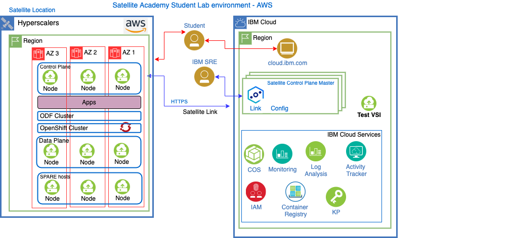
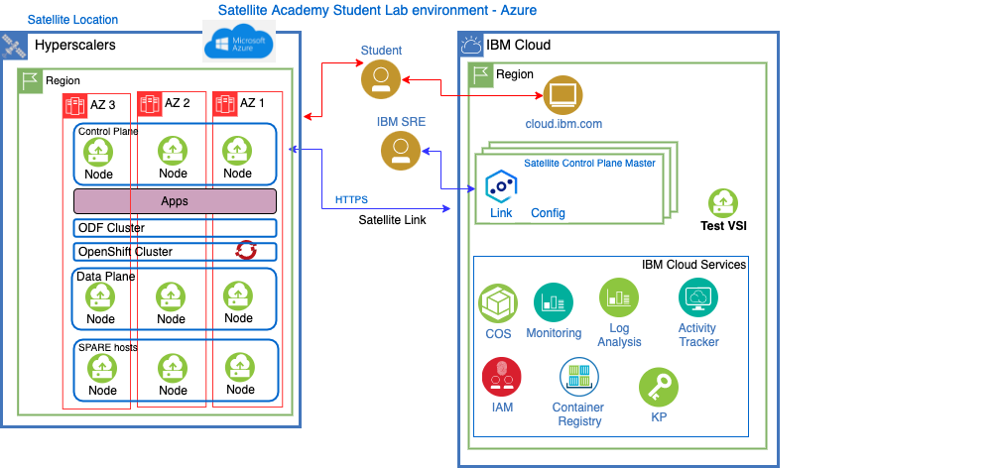
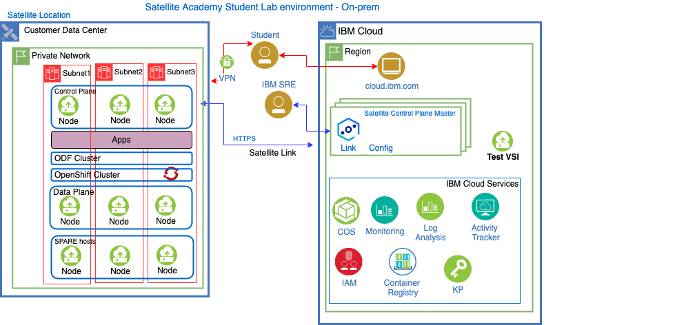
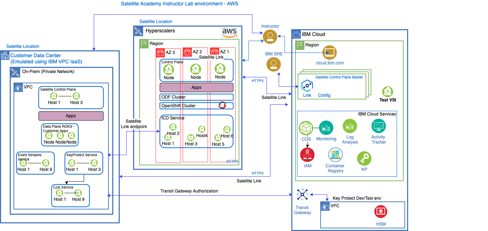

# Satellite Tech Academy 2022 Handbook

## Schedule

1. Satellite Session #1 July 18th - 21st
1. Satellite Session #2 August 15th -- 18th
1. Satellite Session #3 August 29th -- Sept 1st

Format: Classroom
Location: Raleigh, North Carolina

## Table of Contents

1. [Overview](#overview)
1. [Lab environment](#lab-environment)
1. [Student's tasks to be performed](#students-tasks-to-be-performed)
1. [Student Pre-requisites](#student-pre-requisites)
1. [Readiness for the academy Labs](#readiness-for-the-academy-labs)
1. [Day 1](#day-1)
1. [Day 2](#day-2)
1. [Day 3](#day-3)
1. [Day 4](#day-4)
1. [Get certified](#get-certified)
1. [Lab cleanup](#lab-cleanup)

## Overview

The Cloud Platform SKO Technical Academy teaches the skills needed to

- Develop L4/PoC-level skills on specific topics​
- Solution, Design and Prepare to deliver a Proof of Concept
- Provision and configure solution​ in a complex hybrid cloud environment
- Build customizable use case driven demos

The attendee will begin to gain expert skills which will enable them to handle complex use case scenarios independently. When the attendee successfully completes this class they will be prepared to mentor and help develop less experienced employees in his/her assigned subject area. Three tracks are offered that focus on delivering deep level of training and this handbook is for the Academy sessions

- **IBM Cloud Satellite**

This is an invitation only event and to qualify to attend, you must
complete the following pre-req's and pre-work defined for the track you
wish to attend. We also require all IBM employees to have a sign of from
their FLM's to attend.

For more information about **SKO Technical Academy for Cloud Platform** is available [**here**](https://ibm.seismic.com/Link/Content/DCHhRX6CMCggXGWFGhjVhqB86Phd)

> Note: In this document reference to "participants" or "students" is for those who are nominated to attend the Academy session to gain hands-on experience.

## Lab environment

Infrastructure required for the lab is provided by IBM Technology Zone, for the students to perform hands-on exercises during the workshop.
Infrastructure provided by TechZone includes IBM cloud account, credentials required to create Satellite locations using AWS, Azure and
on-prem infrastructure.

There are two parts to the lab environment, one that is required for the student to use and other for the instructor led scenarios. Please see below diagrams for Students env for those pre-assigned to AWS, Azure or on-prem.

Source .drawio file for the **Student** Lab env is available [**here**](drawio/Satellite%20Academy%20Student%20Lab%20env.drawio)

AWS Infrastructure environment

Azure Infrastructure environment

VMWare on-prem Infrastructure environment

Source .drawio file for the **Instructor** Lab env is available [**here**](drawio/Satellite%20Academy%20Instructor%20lab%20env.drawio)

Instructor Lab env with Satellite enabled services deployed in Hybrid cloud using two Satellite locations, one on-prem and other in AWS. On-prem satellite locations is emulated using IBM VPC IaaS, for demo purposes, but it can deployed in customer data centers same way.

## Student's tasks to be performed

For details of session agenda and labs to be performed by the students during the workshop by day please click on the link below

## Student Pre-requisites

Students are expected to complete pre-requisites in order to be ready for the workshop and take advantage of it.

- Completion of IBM Cloud Satellite enablement L1-L3 -- Tech /Sales
    Enablement learning curriculum
    <https://techzone.ibm.com/collection/ibm-cloud-satellite-level-3>

- Cloud Platform BTS/PTS should invite the IBM Cloud Platform geo
        Tech Leader to cloud account upon completion for review.  Non
        BTS/PTS participants should add <dusij@us.ibm.com> and contact
        Jagan Dusi for review.

- Completion of ICCT "IBM Cloud Satellite Specialty" training plan,
    confirmed by your FLM.  ICCT certification exam does not need to be
    completed prior to academy training, but participants are expected
    to pass certification exam post academy
    <https://yourlearning.ibm.com/activity/PLAN-5E61CE6D0469>

- IBM Cloud Satellite training:
    <https://www.ibm.com/training/path/ibmcloudsatellite>

Participants are required to complete all the pre-work prior to making travel arrangements.

### Pre-work

Participants are required to complete a pre-work assignment a week prior to Day1 of the Academy. Pre-work includes creating a Satellite location which will enable performing all the hands-on lab exercises during the Academy.
TechZone demos that are pre-assigned are available [**here**](https://techzone.ibm.com/collection/cloud-platform-tech-academy-satellite)

### Environments

Please use the following instructions to create your Satellite location depending on your environment:

1. [AWS](aws/aws-prework.md)
1. [Azure](azure/azure-prework.md)
1. [VMWare On-Prem](vmware/vmware-prework.md)

## Readiness for the academy Labs

Students are required to make sure the following pre-work are completed before Day1 of the Academy

1. Confirm you are pre-assigned to use a TechZone demo to use infrastructure either in AWS or Azure or on-prem

1. Make sure a Satellite location is created and is in "Normal" state

1. Deploy Red Hat OpenShift in Satellite location

NOTE: You can not access OpenShift console until you perform necessary labs during the session

As mentioned above, please use the links below to complete the pre-reqs
<https://techzone.ibm.com/collection/cloud-platform-tech-academy-satellite>

> **Support:** If you have any questions or need help during the pre-work, please post them in the [slack channel](https://ibm-cloudplatform.slack.com/archives/C03NE5ASPAM)

## Day 1

Day1 is arrival registration and attend executive kick off for SKO Academy

Day2, 3 and 4 includes architectural session and hands-on workshops are performed by the students.
Below sections for each Day provide detailed instructions that students will need to perform during the hands-on workshops.

## Day 2

Here is the overview of what students are expected to learn by performing hands-on exercises on this day

- Review status and health of Satellite location created during the pre-work both from IBM Cloud Console and CLIs depending on student's assignments
  - AWS
  - Azure
  - on-prem
- Expose OpenShift Cluster to public access over internet
  - AWS
  - Azure
  - For on-prem it remains private access over VPN and no public access is allowed
- Add two new hosts to Satellite location
  - To AWS location using AWS CLI
  - To Azure location using Azure CLI
  - For on-prem when you requested TechZone reservation, two additional hosts should have been pre-provisioned but not attached to the Satellite location
  - Connect over VPN to vcenter to check two spare hosts
- Remove or replace an existing host for Satellite control plane
- Add new worker ndoes to the OpenShift cluster
- Configure OCP Image registry using IBM CoS
- Perform common troubleshooting scenarios
- Perform Satellite location troubleshooting

### Lab 1: Review status of Satellite location

Please follow steps [here](https://github.ibm.com/satellite-academy/student-labs/blob/main/common/healthstatus/readme.md) to check status of Satellite location and cluster

Please review [cloud docs](https://cloud.ibm.com/docs/satellite?topic=satellite-locations) for additional commands

### Labs 2 to 7

| Labs          | AWS           | Azure  | VMWare On-prem  |
| ------------- |:-------------:| ------:| ----------------:|
| Lab 2: Expose OpenShift Cluster to public internet | [link](aws/aws-access-roks-inet.md) | [link](azure/AcademyLabs.md#lab2---expose-roks) | N/A |
| Lab 3: Add new host to Satellite location | [link](aws/aws-add-hosts.md)      |   [link](azure/AcademyLabs.md#lab3---add-new-hosts-to-the-location) |  TBD |
| Lab 4: Remove and replace an existinghost - Control plane | [common](common/assign-hosts#add-new-worker-to-roks) | [common](common/assign-hosts#add-new-worker-to-roks) | [common](common/assign-hosts#add-new-worker-to-roks) |
| Lab 5: Add new worker node or (Remove and replace an existing host) | [common](common/assign-hosts#add-new-worker-to-roks) | [common](common/assign-hosts#add-new-worker-to-roks) | [common](common/assign-hosts#add-new-worker-to-roks) |
| Lab 6: Configure OCP Image registry using IBM CoS | [common](common/cos-image-registry) | [common](common/cos-image-registry) | [common](common/cos-image-registry) |
| Lab 7: Configure activity tracker and logging instances | [common](common/observability) | [common](common/observability) | [common](common/observability) |

> About Lab 6: Configure OCP Image registry using IBM CoS
>
> When you install Cloud Pak for Data, the installer is going to copy the images Cloud Pak for Data will use to your local image registry. This is done to greatly improve the speed of the installation process. The first thing we are going to do is create an IBM Cloud Object Storage instance and bucket.

### Lab 8: Perform Satellite location troubleshooting by Sigex team

## Day 3

Here is the overview of what students are expected to learn by performing hands-on exercises on this day:

- Configure Satellite storage template using Red Hat OpenShift Data Foundation (ODF) (formerly known as Openshift Container Storage OCS). Labs included are to deploy ODF with remote disks as well as local disks.

- Create Satellite Link endpoint and test them to access resources in the cloud or in the location.

- Aspects of Observeability by using Activity tracking, Logging and monitoring from the Satellite location, ROKS cluster and application deployed.

- Watch how to troubleshoot and debug Satellite related issues.

### Lab 9 to 10

| Labs          | AWS           | Azure  | VMWare On-prem  |
| ------------- |:-------------:| ------:| ----------------:|
| Lab 9 : Configure ODF | [link](aws/aws-odf-ebs.md) | [link](azure/AcademyLabs.md#lab9---deploy-odf) | vmware/wmware-odf.md |
| Lab 10: Configure Link Endpoints | [common](link/satellite-link-config-lab.md) | [common](link/satellite-link-config-lab.md) | [common](link/satellite-link-config-lab.md) |

> Troubleshooting ODF
> Some command lines [**here**](common/odf-troubleshootings) to help you troubleshoot ODF related issues.

### Deploy test application using Satellite config

TBD Link to be added to Matt's Gitrepo

### How to use Activity Tracker, Logging and Monitoring

This is an instructor led lab activity where you will see how to use observeability.

- Using **Activity Tracker** to track events by toggling Link endpoint. Click [**here**](instructor-labs/activity-tracker-lab/steps.md)

- Using **Monitoring** to see monitoring in action for Health of Satellite location. Click [**here**](instructor-labs/infrastructure-monitor-lab/steps.md)

### Instructor Lab - Perform troubleshooting, debugging and RCA

This is an instructor led lab activity where you will see how to use observability

### Download IBM CLI Plugins to work with Satellite enabled services such as ICD, CoS, ES and KP

TBD

## Day 4

### Q&A with Product management team

Please engage with Product management team and clarify your questions or customer objections to be able to differentiate IBM Cloud Satellite against competition with good value proposition.

### Instructor led Satellite services labs

Here is the overview of what students are expected to learn by performing hands-on exercises on this day

- Learn from Instructor led session to understand capabilities of each Satellite enabled service as below and on how to deploy Satellite them  onto Satellite location
  - ICD
  - KP
  - CoS
  - Event Streams

- Experience working with Satellite enabled services with hands-on labs
  - ICD
  - KP
  - CoS
  - Event Streams

### Satellite for FS and SCC

[Show and tell of techzone demo](https://techzone.ibm.com/collection/SatelliteForFSControls)

### Lab 11: Instructor led ICD hands-on experience

1. Connect to a PostgreSQL database deployed in an ICD instance running in a Satellite location

    a.  Configure CLI, Redli, Pgadmin, DBVisualizer

    b.  Connect to a sample DB using above tools

    c.  Create a sample schema, table,

    d.  Insert, update data

    e.  Backup the database

    f.  Check backup history

    g.  Check logs for the sample table

    h.  Restore

1. Connect to Redis database

    a.  onfigure CLI, Redli, Pgadmin, DBVisualizer

    b.  Connect to a sample DB using above tools

    c.  Create a sample schema, table,

    d.  Insert, update data

    e.  Backup the database

    f.  Check backup history

    g.  Check logs for the sample table

    h.  Restore

### Lab 12: KP hands-on experience

### Lab 13: CoS hands-on experience

### Lab 14: Event Streams hands-on experience

### Open Q&A Session

## Get certified

TBD

## Lab cleanup

This needs to be completed within 72 hours after completing the academy session. [Cleanup instructions](common/cleanup/readme.md)
