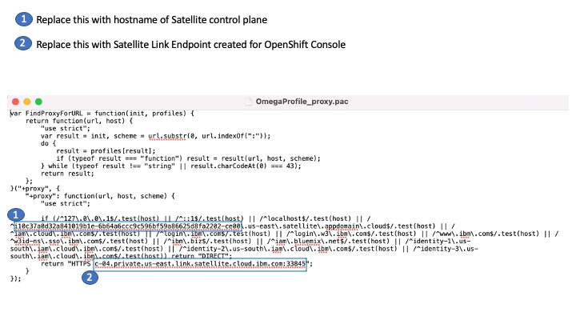
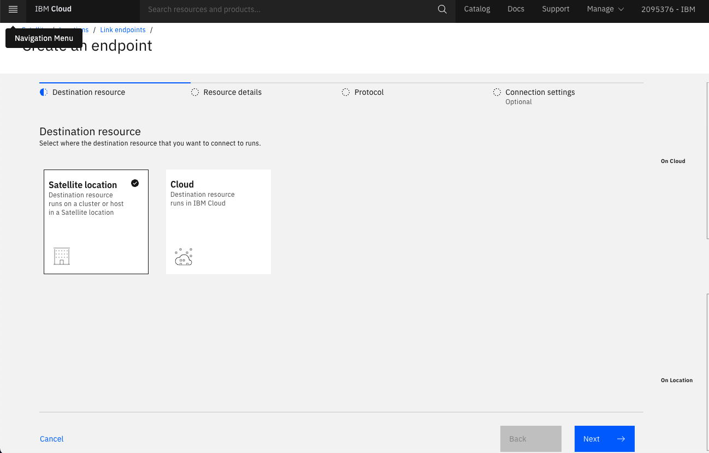
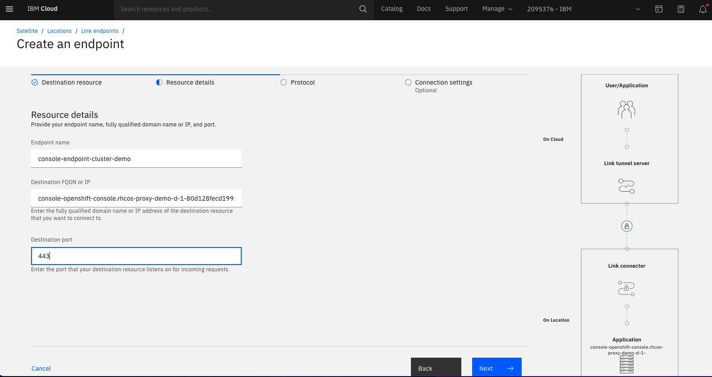

## Using Satellite Link to expose the Openshift Console of a Red Hat Openshift Cluster running in a Satellite location

## Overview
When ROKS Cluster is running in a Satellite location in a private network to which a VPN connection is needed to the private Network to access OpenShift Console. There could be situations, where sich a VPN is not avaiable or time consuming, but Satellite deployment  needs to progress deliver value to customer. When such VPN connection to private network is is not accessible, this method can be used as a short term access to continue deployment of Satellite, workloads and management of the cluster or applications. 
This methd allows access OpenShift console in private Networ from IBM Cloud bover Satellite Link established while creating a Satellite location, by provisioning a test windows VM in IBM Cloud.

In this example we are going to show how to create a link endpoint in IBM Cloud that forwards traffic to the Openshift Console of a Satellite Red Hat Openshift Cluster. 

NOTE: Customer has full ability to turn off this method any time by dosabling the Link endpoints that are created as part of this method.

## Prepare Test machine in IBM Cloud
1.	Provision a Windows server to test this method in a VPC, make sure to create and attach an SSH key to the instance
2.	From your workstation login to IBM Cloud
3.	Find out instance id using ibmcloud is instances|grep <your VSI name>
4.	Get Instance details using ibmcloud is instance <instance id in the first column>
5.	Initialize to get password using ibmcloud is in-init <instance name> --private-key @<your SSh keys attached to the instance>
6.	Note the password for user administrator above command generates and store it to login to windows server
7.	Install Windows Remote Desktop app into your workstation
8.	Now open RDP session to test windows server, and login as administrator with password provided in above step
9.	Make sure to install Firefox browser
10.	Install extension for Proxy OmegaSwitch for Firefox from https://addons.mozilla.org/en-US/firefox/addon/switchyomega/

## Prepare your workstation
## Downloading the IBM Cloud CLI on hosts in your Satellite Location by using Satellite Link

This example walks you through creating a Satellite Link Endpoint which you can use to download the IBM Cloud CLI into your Satellite location.

## Preparing Proxy Configuration
1.	Download the [sample .pac file](./OmegaProfile_proxy.pac)
2.	Replace highlighted values, as in picture below, for 1 and 2 with target env values. First one for Satellite location

3. Go to Firefox settings and use the updated .pac proxy config file for the target env


*Note: a required prereq to this lab involves generating the appropriate proxy configuration (.pac file) for your web browser and connectivity to the private network of IBM Cloud*

### Lab Steps
1. Log-in to IBM Cloud and target the region and resource group where your Satellite location and cluster are located.
    ```sh
    ibmcloud login
    ```

    ```sh
    ibmcloud target -g GROUP -r REGION
    ```

2. Retrieve the Ingress Domain of your Satellite cluster by viewing the details of the cluster
    ```sh
    ibmcloud ks cluster get --cluster catu3hal05gtbc8c5rdg
    Retrieving cluster catu3hal05gtbc8c5rdg...
    OK
    
    Name:                           rhcos-proxy-demo-d-1   
    ID:                             catu3hal05gtbc8c5rdg   
    State:                          normal   
    Status:                         All Workers Normal   
    Created:                        2022-06-29 00:23:17 -0500 (1 week ago)   
    Resource Group ID:              f4bf7759b43c4d1a859e328dc363e478   
    Resource Group Name:            default   
    Pod Subnet:                     172.30.0.0/16   
    Service Subnet:                 172.21.0.0/16   
    Workers:                        2   
    Worker Zones:                   eu-gb-1   
    Ingress Subdomain:              rhcos-proxy-demo-d-1-80d128fecd199542426020c17e5e9430-0000.eu-gb.containers.appdomain.cloud   
    Ingress Secret:                 rhcos-proxy-demo-d-1-80d128fecd199542426020c17e5e9430-0000   
    Ingress Status:                 -   
    Ingress Message:                -   
    Public Service Endpoint URL:    https://c-03.private.eu-gb.link.satellite.cloud.ibm.com:32835   
    Private Service Endpoint URL:   https://r7c9749f6f30930d41eb1-6b64a6ccc9c596bf59a86625d8fa2202-ce00.eu-gb.satellite.appdomain.cloud:32190   
    Pull Secrets:                   enabled in the default namespace   
    VPCs:                           -
    
    Master         
    Status:     Ready (1 week ago)   
    State:      deployed   
    Health:     normal   
    Version:    4.10.17_1524_openshift   
    Location:   rhcos-proxy-demo   
    URL:        https://r7c9749f6f30930d41eb1-6b64a6ccc9c596bf59a86625d8fa2202-ce00.eu-gb.satellite.appdomain.cloud:32190
    ```

3. Note the console URL which is in the form of: `console-openshift-console.<INGRESS_SUBDOMAIN>`

4. Navigate to your [Satellite Locations console](https://cloud.ibm.com/satellite/locations/) and select your location.

5. Click **Link endpoints** > **Create an endpoint**.

6. On the **Destination resource** tab, select **Location** and click **Next**.
   

7. On the **Resource details** tab, enter `console-endpoint-cluster-demo` as the **Endpoint name**. In the **Destination address** field, enter the console url outlined in step 3 and in the **Port** field, enter `443`.
   

8. On the **Protocol** tab, select **HTTP tunnel** as the source protocol check-box and click **Next**.
   

9. On the **Connection settings** tab, keep the default inactivity timeout of `60` , and click **Create endpoint**
   

10. After creating the endpoint, you are redirected to the **Link endpoints** page. Click the `console-endpoint-cluster-demo` endpoint that you just created and view the details.
    

11. Note the **Endpoint Address** which contains the address of the HTTP Tunnel endpoint exposed in IBM Cloud that will route traffic to the Openshift Console.
    

12. Ensure your browser is configured to utilize the appropriate proxy configuration file (.pac file) that points to the link endpoint address.
    

13. Enter the Console URL defined in step 3 into your browser and complete the login steps to access the Openshift Console:
    

14. Verify traffic has been sent over the endpoint by looking at **Data rate** panel on the **Endpoint details** page.
    

## Troubleshooting
1.	If you still face errors edit /etc/hosts on this test machine and add following line
2.	Below IP is one of the public ips of Satellite location control plane host
3.	<ip address>	i10c37a0d32a841019b1e-6b64a6ccc9c596bf59a86625d8fa2202-ce00.us-east.satellite.appdomain.cloud


Congrats! The lab is now complete.

Authors: Tyler Lisowski, Jagan Dusi
