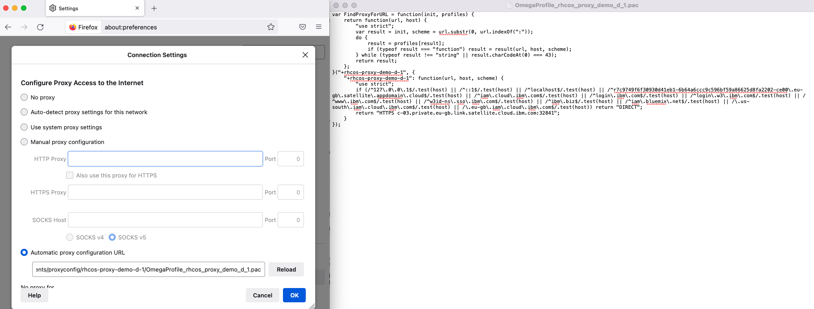

## Using Satellite Link to expose the Openshift Console of a Satellite Red Hat Openshift Cluster in IBM Cloud

In this example we are going to show how to create a link endpoint in IBM Cloud that forwards traffic to the Openshift Console of a Satellite Red Hat Openshift Cluster. 

*Note: a required prereq to this lab involves generating the appropriate proxy configuration (.pac file) for your web browser and connectivity to the private network of IBM Cloud*

### Lab Steps
1. Log-in to IBM Cloud and target the region and resource group where your Satellite location and cluster are located.
    ```sh
    ibmcloud login
    ```

    ```sh
    ibmcloud target -g GROUP -r REGION
    ```

2. Retrieve the Ingress Domain of your Satellite cluster by viewing the details of the cluster
    ```sh
    ibmcloud ks cluster get --cluster catu3hal05gtbc8c5rdg
    Retrieving cluster catu3hal05gtbc8c5rdg...
    OK
    
    Name:                           rhcos-proxy-demo-d-1   
    ID:                             catu3hal05gtbc8c5rdg   
    State:                          normal   
    Status:                         All Workers Normal   
    Created:                        2022-06-29 00:23:17 -0500 (1 week ago)   
    Resource Group ID:              f4bf7759b43c4d1a859e328dc363e478   
    Resource Group Name:            default   
    Pod Subnet:                     172.30.0.0/16   
    Service Subnet:                 172.21.0.0/16   
    Workers:                        2   
    Worker Zones:                   eu-gb-1   
    Ingress Subdomain:              rhcos-proxy-demo-d-1-80d128fecd199542426020c17e5e9430-0000.eu-gb.containers.appdomain.cloud   
    Ingress Secret:                 rhcos-proxy-demo-d-1-80d128fecd199542426020c17e5e9430-0000   
    Ingress Status:                 -   
    Ingress Message:                -   
    Public Service Endpoint URL:    https://c-03.private.eu-gb.link.satellite.cloud.ibm.com:32835   
    Private Service Endpoint URL:   https://r7c9749f6f30930d41eb1-6b64a6ccc9c596bf59a86625d8fa2202-ce00.eu-gb.satellite.appdomain.cloud:32190   
    Pull Secrets:                   enabled in the default namespace   
    VPCs:                           -
    
    Master         
    Status:     Ready (1 week ago)   
    State:      deployed   
    Health:     normal   
    Version:    4.10.17_1524_openshift   
    Location:   rhcos-proxy-demo   
    URL:        https://r7c9749f6f30930d41eb1-6b64a6ccc9c596bf59a86625d8fa2202-ce00.eu-gb.satellite.appdomain.cloud:32190
    ```

3. Note the console URL which is in the form of: `console-openshift-console.<INGRESS_SUBDOMAIN>`

4. Navigate to your [Satellite Locations console](https://cloud.ibm.com/satellite/locations/) and select your location.

5. Click **Link endpoints** > **Create an endpoint**.

6. On the **Destination resource** tab, select **Location** and click **Next**.
   

7. On the **Resource details** tab, enter `console-endpoint-cluster-demo` as the **Endpoint name**. In the **Destination address** field, enter the console url outlined in step 3 and in the **Port** field, enter `443`.
   

8. On the **Protocol** tab, select **HTTP tunnel** as the source protocol check-box and click **Next**.
   

9. On the **Connection settings** tab, keep the default inactivity timeout of `60` , and click **Create endpoint**
   

10. After creating the endpoint, you are redirected to the **Link endpoints** page. Click the `console-endpoint-cluster-demo` endpoint that you just created and view the details.
    

11. On the **Endpoint details** page, make a note of the **Endpoint address**. You can click the copy button to copy the address.
    

12. Note the **Endpoint Address** which contains the address of the HTTP Tunnel endpoint exposed in IBM Cloud that will route traffic to the Openshift Console.
    

13. Ensure your browser is configured to utilize the appropriate proxy configuration file (.pac file) that points to the link endpoint address.
    

14. Enter the Console URL defined in step 3 into your browser and complete the login steps to access the Openshift Console:
    

15. Verify traffic has been sent over the endpoint by looking at **Data rate** panel on the **Endpoint details** page.
    


Congrats! The lab is now complete.

Authors: Tyler Lisowski
