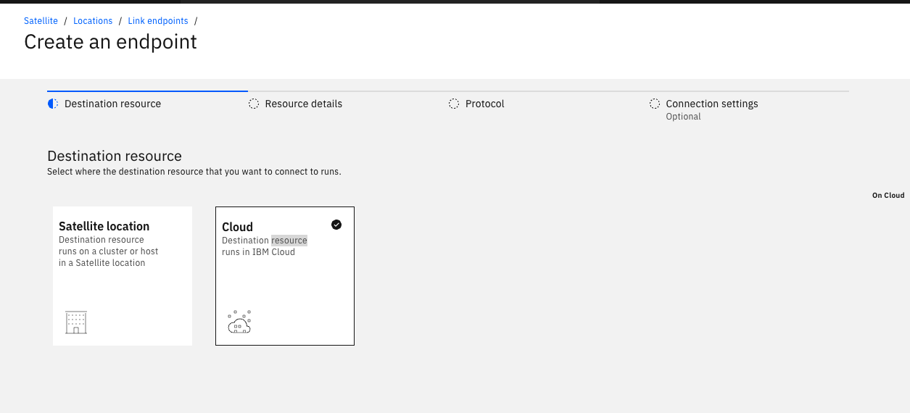
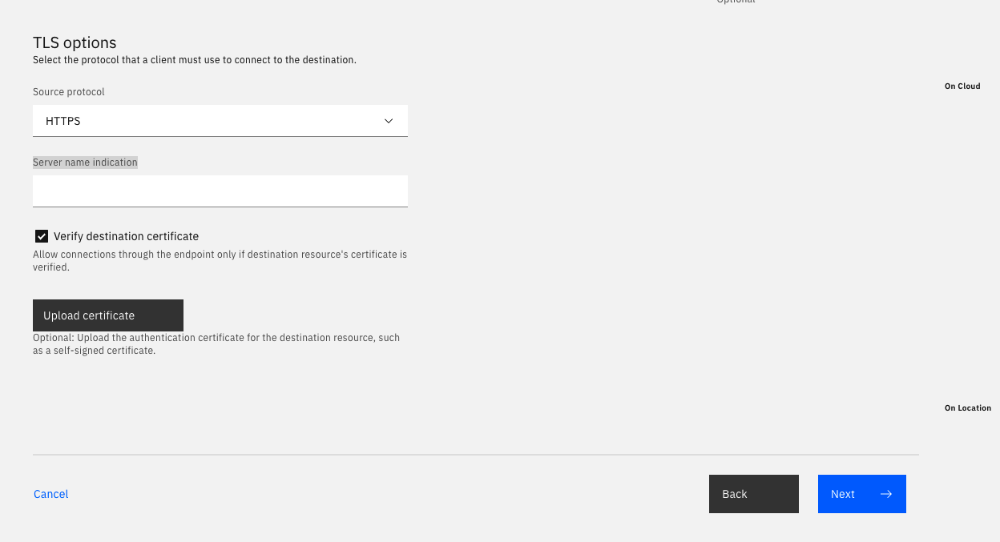
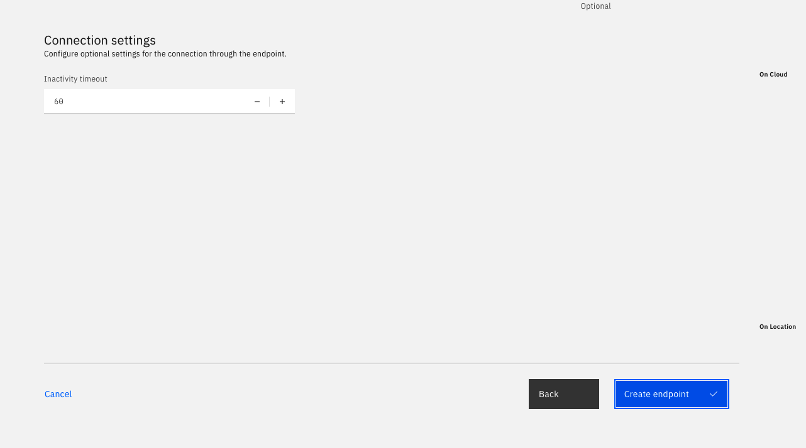

    
### Lab Steps
1. Navigate to your [Satellite Locations console](https://cloud.ibm.com/satellite/locations/) and select your location. 
2. Click **Link endpoints** > **Create an endpoint**.

2. On the **Destination resource** tab, select **Cloud** and click **Next**.



3. On the **Resource details** tab, enter `download-clis-cloud-ibm-com` as the **Endpoint name**. In the **Destination address** field, enter `download.clis.cloud.ibm.com` and in the **Port** field, enter `443`.


4. On the **Protocol** tab, select **HTTPS** as the source protocol and check the **Verify destination certificate** check-box and click **Next**.


5. On the **Connection settings** tab, keep the default inactivity timeout of `60` , and click **Create endpoint**


6. After creating the endpoint, you are redirected to the **Link endpoints** page. Click the `download-clis-cloud-ibm-com` endpoint that you just created and view the details.


7. On the **Endpoint details** page, make a note of the **Endpoint address**. You can click the copy button to copy the address.


8. Log-in to IBM Cloud and target the region and resource group where your Satellite location and cluster are located. 
    ```sh
    ibmcloud login
    ```
    
    ```sh
    ibmcloud target -g GROUP -r REGION
    ```

9. List your clusters, make a note of the cluster ID of your Satellite cluster, then download the `kubeconfig`.
    ```sh
    ibmcloud ks cluster ls
    ```
    
    ```
    ibmcloud ks cluster config --cluster CLUSTERID --admin
    ```

10. Log-in to the `openshift-console` pod and download the IBM Cloud CLI Installer script by using the Link endpoint that you created earlier.
    ```sh
    kubectl exec -it -n openshift-console  deploy/console bash
    ```

12. Curl the Link endpoint that you created earlier to download the IBM Cloud CLI Installer script into your Location.
    ```
    bash-4.4$ curl https://ENDPOINT_ADDRESS/ibm-cloud-cli-installer-scripts/linux
    #!/bin/sh
    host="download.clis.cloud.ibm.com"
    metadata_host="$host/ibm-cloud-cli-metadata"
    binary_download_host="$host/ibm-cloud-cli"
    ...
    ```

     Example commands.
    ```
    ibmcloud ks cluster config --cluster canqs7tl0hrf12canr8g --admin
    OK
    The configuration for canqs7tl0hrf12canr8g was downloaded successfully.

    kubectl exec -it -n openshift-console  deploy/console bash
    kubectl exec [POD] [COMMAND] is DEPRECATED and will be removed in a future version. Use kubectl exec [POD] -- [COMMAND] instead.
    bash-4.4$ curl https://t471ec4b40dc029fdb318-6b64a6ccc9c596bf59a86625d8fa2202-c000.eu-gb.satellite.appdomain.cloud:31545/ibm-cloud-cli-installer-scripts/linux
    #!/bin/sh
      
    host="download.clis.cloud.ibm.com"
    metadata_host="$host/ibm-cloud-cli-metadata"
    binary_download_host="$host/ibm-cloud-cli"
    ...
    ```

9. Verify traffic has been sent over the endpoint by looking at **Data rate** panel on the **Endpoint details** page.


13. On the **Endpoint details** page, click the **Actions** menu and select **Disable** to disable the endpoint. 


11) Test that the endpoint is disabled by logging back into the console pod and attempting to download the IBM Cloud CLI Installer script from the Link endpoint.
    ```
    kubectl exec -it -n openshift-console  deploy/console bash
    kubectl exec [POD] [COMMAND] is DEPRECATED and will be removed in a future version. Use kubectl exec [POD] -- [COMMAND] instead.
    bash-4.4$ curl https://ENDPOINTADDRESS/ibm-cloud-cli-installer-scripts/linux
    curl: (7) Failed to connect to ENDPOINTHOST port ENDPOINTPORT: Connection refused
    ```

    Example commands.

    ```
    kubectl exec -it -n openshift-console  deploy/console bash
    kubectl exec [POD] [COMMAND] is DEPRECATED and will be removed in a future version. Use kubectl exec [POD] -- [COMMAND] instead.
    bash-4.4$ curl https://t471ec4b40dc029fdb318-6b64a6ccc9c596bf59a86625d8fa2202-c000.eu-gb.satellite.appdomain.cloud:31545/ibm-cloud-cli-installer-scripts/linux
    curl: (7) Failed to connect to t471ec4b40dc029fdb318-6b64a6ccc9c596bf59a86625d8fa2202-c000.eu-gb.satellite.appdomain.cloud port 31545: Connection refused
    ```

12. In the **Actions** menu on the **Endpoint details** page, re-enable the endpoint.


13) Exec into the console pod again and verify that the IBM Cloud CLI Installer script can be downloaded from the link endpoint
    ```
    kubectl exec -it -n openshift-console  deploy/console bash
    kubectl exec [POD] [COMMAND] is DEPRECATED and will be removed in a future version. Use kubectl exec [POD] -- [COMMAND] instead.
    bash-4.4$ curl https://ENDPOINTADDRESS/ibm-cloud-cli-installer-scripts/linux
    #!/bin/sh

    host="download.clis.cloud.ibm.com"
    metadata_host="$host/ibm-cloud-cli-metadata"
    binary_download_host="$host/ibm-cloud-cli"
    ...
    ```

    Example commands.

    ```
    kubectl exec -it -n openshift-console  deploy/console bash
    kubectl exec [POD] [COMMAND] is DEPRECATED and will be removed in a future version. Use kubectl exec [POD] -- [COMMAND] instead.
    bash-4.4$ curl https://t471ec4b40dc029fdb318-6b64a6ccc9c596bf59a86625d8fa2202-c000.eu-gb.satellite.appdomain.cloud:31545/ibm-cloud-cli-installer-scripts/linux
    #!/bin/sh

    host="download.clis.cloud.ibm.com"
    metadata_host="$host/ibm-cloud-cli-metadata"
    binary_download_host="$host/ibm-cloud-cli"
    ...
    ```

14. Delete the endpoint


Amazing Work! This concludes the lab exercise.

Authors: Tyler Lisowski and Derek Poindexter
