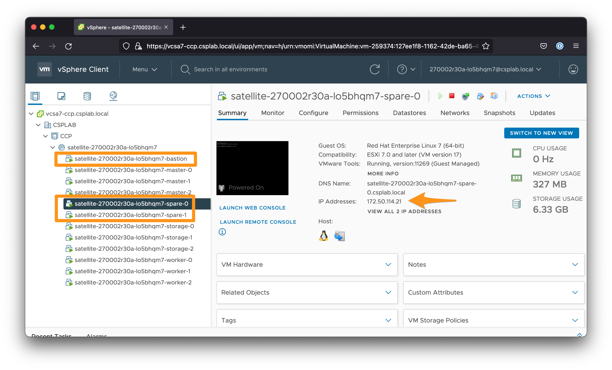

# Adding Hosts to VMWare based Satellite Location

## Review

The following resources are created by the VMWare template in the account you've been invited to

- 1 Bastion host
- 3 hosts named master for the Satellite Control Plane
- 3 hosts named worker for the OpenShift worker nodes
- 3 hosts for the the storage and ODF
- 2 hosts spared not attached to the location.

## Retrieve the IPs of the bastion and the two RHEL hosts

We would like to add to our existing location 2 hosts we need later for other exercises. In a real customer environment you would automate the following steps, using Terraform, Ansible or other automation capabilities.

1. Connect to vSphere client to retrieve the IP of the bastion and the 2 hosts by following these [instructions](./vmware-prework.md#connect-to-vsphere-client). You will need those IPs to SSH in each machine later.

   

1. Connect to the **bastion** host following these [instructions](./vmware-prework.md#connect-to-the-bastion-through-ssh)

1. Download and install the IBM Cloud CLI on the bastion linux host

   ```sh
   curl -fsSL https://clis.cloud.ibm.com/install/linux | sh
   ```

1. Install the IBM Cloud plug-in for Kubernetes Service.

   ```sh
   ibmcloud plugin install container-service
   ```

## Attaching the Hosts to the IBM Cloud Satellite location

Let's attach the hosts to our IBM Cloud Satellite location.

1. In the bastion, connect via IBM Cloud CLI to the IBM Cloud account
  
   ```sh
   ibmcloud login --sso
   ```

   Select the account (i.e. `ITZ - Satellite`)
   Select the region (i.e. `us-east`)

1. Select the Resource Group where your location was created.

   ```sh
   ibmcloud target -g Satellite
   ```

1. Identify your Satelitte location from the list.

   ```sh
   ibmcloud sat location ls
   ```

1. Download the Satellite Location Host attach script
  
   ```sh
   ibmcloud sat host attach --location <your-location-ID>
   ```

   

1. Store the path to the generated script into an environment variable.

   ```sh
   export SCRIPT=<your-script-path>
   ```

   For example:

   ```sh
   export SCRIPT=/tmp/register-host_cb6pupjd0brfjav4hnlg_1671478741.sh
   ```

1. Edit the Script to enable RHEL repos

   Open the registration script. After the `REGION` line, add a section to pull the required RHEL packages with the subscription manager.

   ```sh
   subscription-manager refresh
   subscription-manager repos --enable rhel-server-rhscl-7-rpms
   subscription-manager repos --enable rhel-7-server-optional-rpms
   subscription-manager repos --enable rhel-7-server-rh-common-rpms
   subscription-manager repos --enable rhel-7-server-supplementary-rpms
   subscription-manager repos --enable rhel-7-server-extras-rpms
   ```

      

1. Copy the Script to the spared instances you identifed in the previous section.

   ```sh
   scp $SCRIPT itzuser@172.50.114.21:/home/itzuser/
   ```

1. SSH into the spare machine

   ```sh
   ssh itzuser@172.50.114.21
   ```

1. Make the script executable

   ```sh
   cd /home/itzuser/
   chmod +x <your-register-script>
   ```

1. Instructs the system to continue running it even if the session is disconnected

   ```sh
   sudo nohup bash $SCRIPT &
   ```

1. Monitor the progress of the registration script. Wait.

   ```sh
   sudo journalctl -f -u ibm-host-attach
   ```

   <!-- TBD  -->

1. Repeat Step 4-6 on your 2 new hosts.

1. Check that your hosts are shown in the **Hosts** tab of your Sattelite location.

   <!-- TBD  -->
